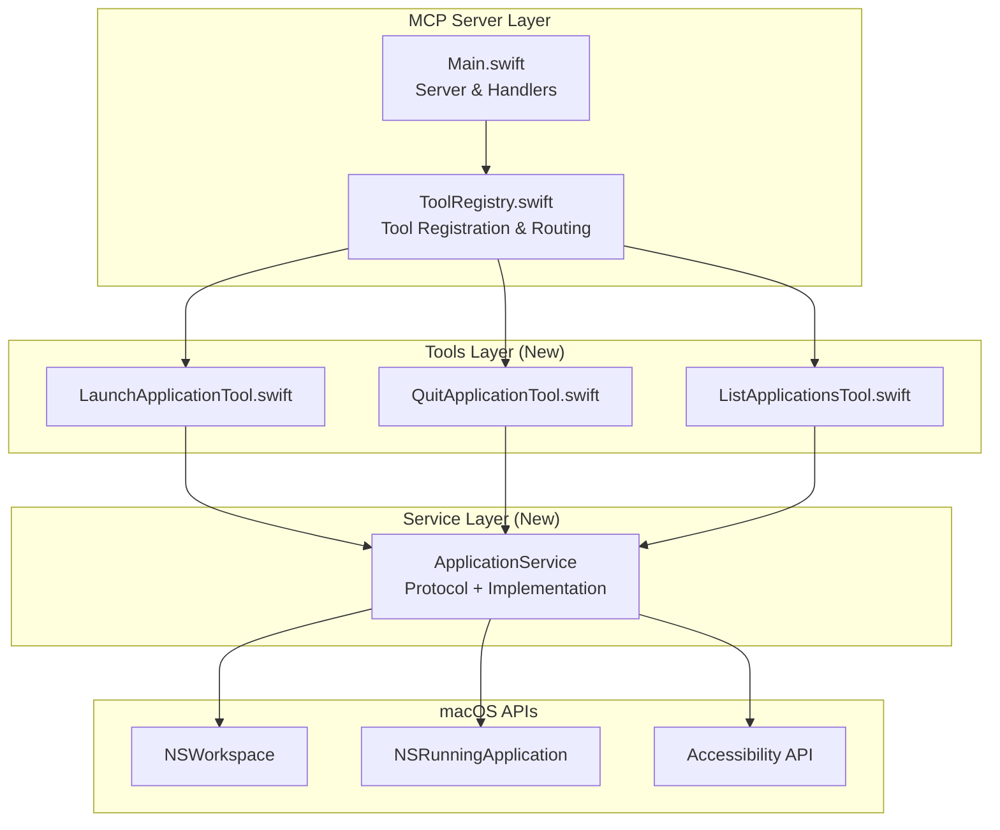
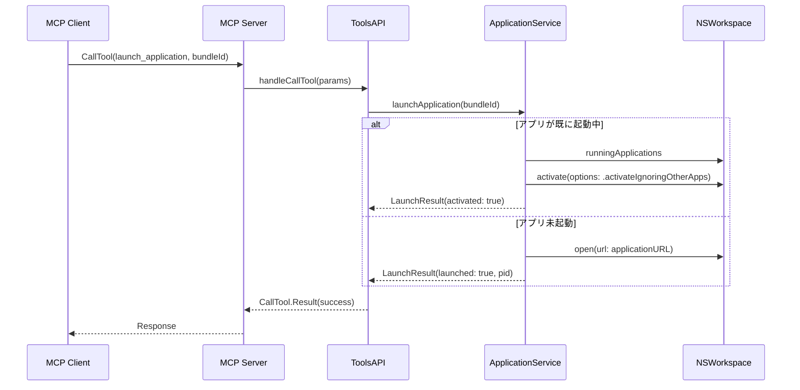
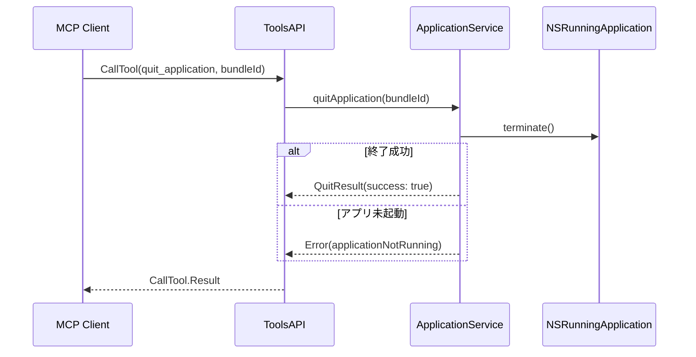

# Design Document: App Launch Control

## Overview

**Purpose**: 本機能は、macOS Workspace MCPサーバーにアプリケーション起動・終了制御機能を追加し、Claudeを通じた自然言語によるアプリケーション操作を実現する。

**Users**: Claude Codeユーザーが、Spotlight検索やDock操作を介さずにアプリケーションを制御できる。

**Impact**: 既存のMCPサーバー（`Main.swift`, `ToolsAPI.swift`）に3つの新規ツール（`launch_application`, `quit_application`, `list_applications`）を追加する。

### Goals
- bundle IDまたはアプリケーション名によるアプリ起動・終了
- 起動中アプリケーション一覧の取得
- 明確なエラーハンドリングとMCPプロトコル準拠

### Non-Goals
- ウィンドウ位置・サイズ制御（別機能として実装予定）
- 複数アプリの一括操作
- アプリケーションのインストール・アンインストール

## Architecture

### Existing Architecture Analysis

現在のコードベースは以下の構造:
- `Main.swift`: MCPサーバーのエントリポイント、ハンドラー登録
- `ToolsAPI.swift`: ツール定義とビジネスロジック（`handleListTools`, `handleCallTool`）

本設計では、ツールごとにファイルを分割する新しいパターンを導入する。`Tools/`フォルダを作成し、各ツールを独立したファイルで管理する。

### Architecture Pattern & Boundary Map



**Architecture Integration**:
- **Selected pattern**: Tool-per-File Pattern + Service Layer Pattern
- **Domain boundaries**: 各ツールを独立ファイルで管理し、共通ロジックはServiceに集約
- **New structure**: `Tools/`フォルダでツールをモジュール化、`ToolRegistry`でルーティング
- **New components rationale**: ツール追加時の変更範囲を最小化、テスタビリティ向上
- **Steering compliance**: macos-automation.mdのパターンに準拠

### Technology Stack

| Layer | Choice / Version | Role in Feature | Notes |
|-------|------------------|-----------------|-------|
| Runtime | Swift 6.0 / macOS 15+ | 実行環境 | StrictConcurrency対応 |
| MCP SDK | swift-sdk 0.10.0+ | プロトコル実装 | StdioTransport使用 |
| App Control | NSWorkspace / NSRunningApplication | アプリ起動・終了 | Foundation標準 |
| Permission | Accessibility API | 権限確認 | ApplicationServices |

## System Flows

### アプリケーション起動フロー



### アプリケーション終了フロー



## Requirements Traceability

| Requirement | Summary | Components | Interfaces |
|-------------|---------|------------|------------|
| 1.1-1.5 | アプリケーション起動 | ApplicationService, ToolsAPI | launch_application tool |
| 2.1-2.5 | アプリケーション終了 | ApplicationService, ToolsAPI | quit_application tool |
| 3.1-3.4 | 起動中アプリ一覧 | ApplicationService, ToolsAPI | list_applications tool |
| 4.1-4.3 | 権限管理 | ApplicationService | checkAccessibilityPermission() |
| 5.1-5.4 | エラーハンドリング | WorkspaceError, ToolsAPI | 全ツール共通 |
| 6.1-6.5 | MCPツール定義 | ToolsAPI | Tool definitions |

## Components and Interfaces

| Component | Domain/Layer | Intent | Req Coverage | Key Dependencies | Contracts |
|-----------|--------------|--------|--------------|------------------|-----------|
| ToolRegistry | MCP Layer | ツール登録・ルーティング | 6.1-6.5 | 各Tool (P0) | Service |
| LaunchApplicationTool | Tools Layer | アプリ起動ツール | 1.1-1.5 | ApplicationService (P0) | Tool |
| QuitApplicationTool | Tools Layer | アプリ終了ツール | 2.1-2.5 | ApplicationService (P0) | Tool |
| ListApplicationsTool | Tools Layer | アプリ一覧ツール | 3.1-3.4 | ApplicationService (P0) | Tool |
| ApplicationService | Service Layer | macOS API抽象化 | 1-4 | NSWorkspace (P0) | Service |
| WorkspaceError | Model Layer | エラー型定義 | 5.1-5.4 | なし | - |
| ApplicationInfo | Model Layer | アプリ情報モデル | 3.1-3.4 | なし | - |

### Service Layer

#### ApplicationServiceProtocol

| Field | Detail |
|-------|--------|
| Intent | macOS API操作を抽象化しテスト可能にする |
| Requirements | 1.1-1.5, 2.1-2.5, 3.1-3.4, 4.1-4.3 |

**Responsibilities & Constraints**
- アプリケーション起動・終了・一覧取得のビジネスロジック
- NSWorkspace/NSRunningApplicationのラッパー
- Accessibility権限確認

**Dependencies**
- Outbound: NSWorkspace — アプリ起動・検索 (P0)
- Outbound: NSRunningApplication — アプリ終了・状態取得 (P0)
- Outbound: Accessibility API — 権限確認 (P1)

**Contracts**: Service [x]

##### Service Interface

```swift
/// アプリケーション制御サービスのプロトコル
protocol ApplicationServiceProtocol: Sendable {
    /// アプリケーションを起動する
    /// - Parameter bundleId: アプリケーションのbundle ID
    /// - Returns: 起動結果（プロセスID、アプリ名、アクティブ化フラグ）
    /// - Throws: WorkspaceError.applicationNotFound, WorkspaceError.launchFailed
    func launchApplication(bundleId: String) async throws -> LaunchResult

    /// アプリケーションを終了する
    /// - Parameter bundleId: アプリケーションのbundle ID
    /// - Returns: 終了結果（アプリ名）
    /// - Throws: WorkspaceError.applicationNotRunning
    func quitApplication(bundleId: String) async throws -> QuitResult

    /// 起動中のアプリケーション一覧を取得する
    /// - Returns: アプリケーション情報の配列
    func listRunningApplications() async -> [ApplicationInfo]

    /// Accessibility権限を確認する
    /// - Returns: 権限が付与されているかどうか
    func checkAccessibilityPermission() -> Bool
}
```

- Preconditions: bundleIdは空文字列でないこと
- Postconditions: 成功時は適切なResult型を返す、失敗時はWorkspaceErrorをthrow
- Invariants: スレッドセーフ（Sendable準拠）

### Tools Layer

各ツールは`MCPTool`プロトコルに準拠し、独立したファイルで管理する。

#### MCPTool Protocol

```swift
/// MCPツールの共通プロトコル
protocol MCPTool: Sendable {
    /// ツール名（MCP準拠のスネークケース）
    static var name: String { get }

    /// ツール定義（Tool型）
    static var definition: Tool { get }

    /// ツール実行
    func execute(arguments: [String: JSONValue]) async -> CallTool.Result
}
```

#### LaunchApplicationTool

| Field | Detail |
|-------|--------|
| Intent | アプリケーション起動機能を提供 |
| Requirements | 1.1-1.5 |

```swift
// Tools/LaunchApplicationTool.swift
struct LaunchApplicationTool: MCPTool {
    static let name = "launch_application"

    static let definition = Tool(
        name: name,
        description: """
            指定されたbundle IDのアプリケーションを起動します。
            アプリが既に起動している場合はアクティブ化（最前面化）します。
            成功時にはプロセスIDとアプリケーション名を返します。
            """,
        inputSchema: .object([
            "type": .string("object"),
            "properties": .object([
                "bundleId": .object([
                    "type": .string("string"),
                    "description": .string("アプリケーションのbundle ID（例: com.apple.Safari）")
                ])
            ]),
            "required": .array([.string("bundleId")])
        ])
    )

    private let service: ApplicationServiceProtocol

    init(service: ApplicationServiceProtocol) {
        self.service = service
    }

    func execute(arguments: [String: JSONValue]) async -> CallTool.Result {
        // パラメーター検証 → service.launchApplication → 結果変換
    }
}
```

#### QuitApplicationTool

| Field | Detail |
|-------|--------|
| Intent | アプリケーション終了機能を提供 |
| Requirements | 2.1-2.5 |

```swift
// Tools/QuitApplicationTool.swift
struct QuitApplicationTool: MCPTool {
    static let name = "quit_application"

    static let definition = Tool(
        name: name,
        description: """
            指定されたbundle IDのアプリケーションを終了します。
            未保存のドキュメントがある場合は保存確認ダイアログが表示されます。
            成功時には終了したアプリケーション名を返します。
            """,
        inputSchema: .object([
            "type": .string("object"),
            "properties": .object([
                "bundleId": .object([
                    "type": .string("string"),
                    "description": .string("アプリケーションのbundle ID（例: com.apple.Safari）")
                ])
            ]),
            "required": .array([.string("bundleId")])
        ])
    )

    private let service: ApplicationServiceProtocol

    init(service: ApplicationServiceProtocol) {
        self.service = service
    }

    func execute(arguments: [String: JSONValue]) async -> CallTool.Result {
        // パラメーター検証 → service.quitApplication → 結果変換
    }
}
```

#### ListApplicationsTool

| Field | Detail |
|-------|--------|
| Intent | 起動中アプリケーション一覧取得機能を提供 |
| Requirements | 3.1-3.4 |

```swift
// Tools/ListApplicationsTool.swift
struct ListApplicationsTool: MCPTool {
    static let name = "list_applications"

    static let definition = Tool(
        name: name,
        description: """
            現在起動中のアプリケーション一覧を取得します。
            各アプリケーションのbundle ID、名前、プロセスIDを返します。
            システムプロセス（UIを持たないバックグラウンドプロセス）は除外されます。
            """,
        inputSchema: .object([
            "type": .string("object"),
            "properties": .object([:])
        ])
    )

    private let service: ApplicationServiceProtocol

    init(service: ApplicationServiceProtocol) {
        self.service = service
    }

    func execute(arguments: [String: JSONValue]) async -> CallTool.Result {
        // service.listRunningApplications → JSON変換
    }
}
```

### MCP Layer

#### ToolRegistry

| Field | Detail |
|-------|--------|
| Intent | ツール登録とルーティングを一元管理 |
| Requirements | 6.1-6.5 |

```swift
// ToolRegistry.swift
enum ToolRegistry {
    /// 登録済みツール一覧
    static let tools: [any MCPTool.Type] = [
        LaunchApplicationTool.self,
        QuitApplicationTool.self,
        ListApplicationsTool.self
    ]

    /// ListToolsハンドラー
    static func handleListTools(_ params: ListTools.Parameters) -> ListTools.Result {
        let definitions = tools.map { $0.definition }
        return .init(tools: definitions, nextCursor: nil)
    }

    /// CallToolハンドラー
    static func handleCallTool(_ params: CallTool.Parameters) async -> CallTool.Result {
        let service = ApplicationService()

        switch params.name {
        case LaunchApplicationTool.name:
            return await LaunchApplicationTool(service: service).execute(arguments: params.arguments ?? [:])
        case QuitApplicationTool.name:
            return await QuitApplicationTool(service: service).execute(arguments: params.arguments ?? [:])
        case ListApplicationsTool.name:
            return await ListApplicationsTool(service: service).execute(arguments: params.arguments ?? [:])
        default:
            return .init(content: [.text("Unknown tool: \(params.name)")], isError: true)
        }
    }
}
```

## Data Models

### Domain Model

```swift
/// アプリケーション起動結果
struct LaunchResult: Sendable {
    let processId: pid_t
    let applicationName: String
    let wasAlreadyRunning: Bool
}

/// アプリケーション終了結果
struct QuitResult: Sendable {
    let applicationName: String
}

/// アプリケーション情報
struct ApplicationInfo: Sendable {
    let bundleId: String
    let name: String
    let processId: pid_t
    let isHidden: Bool
}

/// エラー型
enum WorkspaceError: Error, LocalizedError, Sendable {
    case applicationNotFound(String)
    case applicationNotRunning(String)
    case launchFailed(String, underlying: String)
    case accessibilityPermissionDenied
    case invalidParameter(String)

    var errorDescription: String? {
        switch self {
        case .applicationNotFound(let bundleId):
            return "Application not found: \(bundleId)"
        case .applicationNotRunning(let bundleId):
            return "Application is not running: \(bundleId)"
        case .launchFailed(let bundleId, let underlying):
            return "Failed to launch \(bundleId): \(underlying)"
        case .accessibilityPermissionDenied:
            return "Accessibility permission required. Enable in System Settings > Privacy & Security > Accessibility"
        case .invalidParameter(let message):
            return "Invalid parameter: \(message)"
        }
    }
}
```

## Error Handling

### Error Strategy

MCP準拠のエラーレスポンス形式を使用:

```swift
// エラーレスポンス生成
func errorResult(_ error: WorkspaceError) -> CallTool.Result {
    .init(
        content: [.text("Error: \(error.localizedDescription)")],
        isError: true
    )
}
```

### Error Categories and Responses

| Error Type | HTTP相当 | 条件 | レスポンス |
|------------|----------|------|-----------|
| applicationNotFound | 404 | bundle IDが無効 | `isError: true` + エラーメッセージ |
| applicationNotRunning | 404 | 終了対象アプリが未起動 | `isError: true` + エラーメッセージ |
| launchFailed | 500 | 起動処理失敗 | `isError: true` + 詳細エラー |
| accessibilityPermissionDenied | 403 | 権限不足 | `isError: true` + 設定手順 |
| invalidParameter | 400 | パラメーター不正 | `isError: true` + 検証エラー |

## Testing Strategy

### Unit Tests

TDD Unit Test Policy（出力値/状態ベーステストのみ）に準拠:

1. **LaunchResult生成テスト**: `launchApplication`が正しい`LaunchResult`を返すことを検証
2. **QuitResult生成テスト**: `quitApplication`が正しい`QuitResult`を返すことを検証
3. **ApplicationInfo一覧テスト**: `listRunningApplications`が正しい配列を返すことを検証
4. **エラー変換テスト**: `WorkspaceError`が正しいエラーメッセージを生成することを検証

```swift
// 出力値ベーステスト例
@Test("converts WorkspaceError to localized description")
func errorDescription() {
    let error = WorkspaceError.applicationNotFound("com.example.app")
    #expect(error.localizedDescription == "Application not found: com.example.app")
}
```

### Integration Tests

1. **ToolsAPI ルーティングテスト**: `handleCallTool`が正しいツールにルーティングすることを検証
2. **Tool定義テスト**: `getAvailableTools()`が新規ツールを含むことを検証

### テスト不可能なタスク

以下はmacOS APIへの副作用のみを持つため、テストを書かずに実装:
- 実際のアプリケーション起動処理（NSWorkspace.open）
- 実際のアプリケーション終了処理（NSRunningApplication.terminate）
- Accessibility権限確認（AXIsProcessTrusted）

## File Structure

```
Sources/WorkspaceMCP/
├── Main.swift                           # 既存: ToolRegistry呼び出しに変更
├── ToolsAPI.swift                       # 削除予定（ToolRegistryに移行）
├── ToolRegistry.swift                   # 新規: ツール登録・ルーティング
├── Tools/
│   ├── MCPTool.swift                    # 新規: ツール共通プロトコル
│   ├── LaunchApplicationTool.swift      # 新規: アプリ起動ツール
│   ├── QuitApplicationTool.swift        # 新規: アプリ終了ツール
│   └── ListApplicationsTool.swift       # 新規: アプリ一覧ツール
├── Services/
│   ├── ApplicationServiceProtocol.swift # 新規: プロトコル定義
│   └── ApplicationService.swift         # 新規: 実装
└── Models/
    ├── ApplicationInfo.swift            # 新規: データモデル
    ├── LaunchResult.swift               # 新規: 結果モデル
    ├── QuitResult.swift                 # 新規: 結果モデル
    └── WorkspaceError.swift             # 新規: エラー型

Tests/WorkspaceMCPTests/
├── Tools/
│   ├── LaunchApplicationToolTests.swift # 新規
│   ├── QuitApplicationToolTests.swift   # 新規
│   └── ListApplicationsToolTests.swift  # 新規
├── Services/
│   └── ApplicationServiceTests.swift    # 新規
└── Models/
    └── WorkspaceErrorTests.swift        # 新規
```
