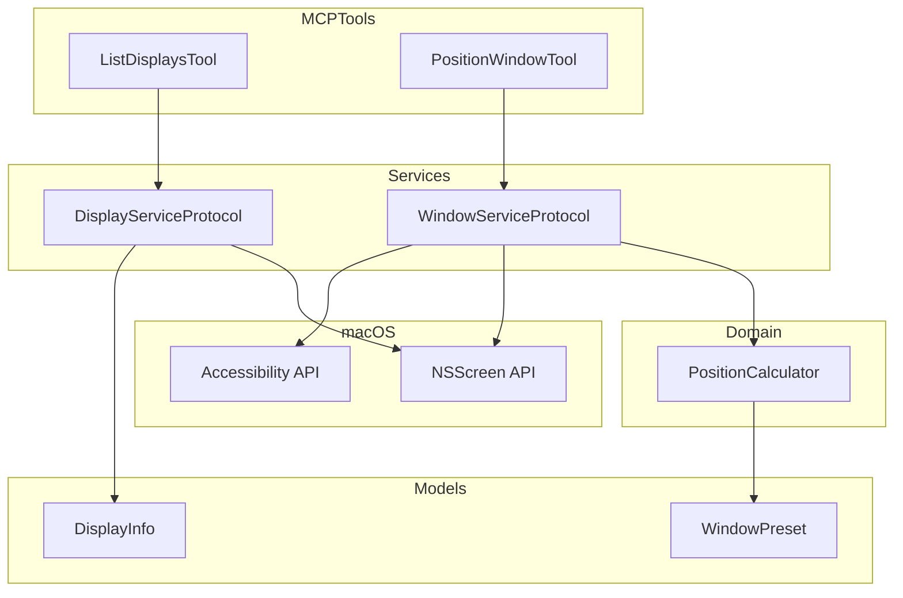
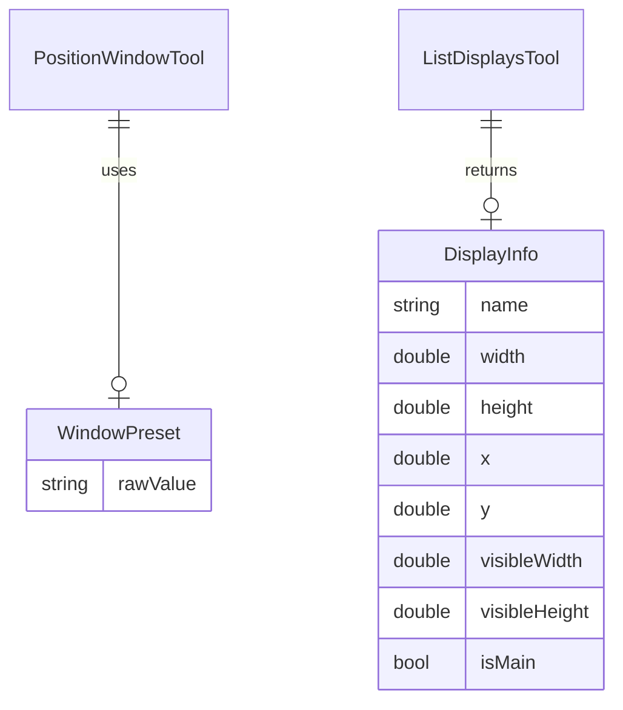

# Design Document

## Overview

**Purpose**: 複数ディスプレイ環境において、ユーザーがウィンドウを任意のディスプレイに移動・配置できる機能を提供する。

**Users**: 複数ディスプレイを使用するユーザーがMCPツールを通じて効率的なウィンドウ配置を実現する。

**Impact**: 既存の`position_window`ツールはすでにディスプレイ指定機能を持つ。本設計では新規`list_displays`ツールの追加と、`center`プリセットの追加を行う。

### Goals
- 接続されているディスプレイの一覧と詳細情報を取得できるMCPツールを提供する
- ウィンドウを指定ディスプレイの中央に配置できるプリセットを追加する
- 既存のposition_windowツールの動作との一貫性を維持する

### Non-Goals
- ディスプレイの設定変更（解像度、配置等）
- 仮想デスクトップ（Spaces）間のウィンドウ移動
- ディスプレイのホットプラグ検出・イベント通知

## Architecture

### Existing Architecture Analysis

現在のシステムは以下の構造を持つ：

- **PositionWindowTool**: ウィンドウ配置ツール（`displayName`パラメータ対応済み）
- **WindowServiceProtocol / DefaultWindowService**: ウィンドウ操作サービス
- **PositionCalculator**: プリセットに基づくフレーム計算
- **WindowPreset**: 配置プリセット列挙型

既存の`determineTargetScreen()`メソッドでNSScreenを使用したディスプレイ検索が実装されている。

### Architecture Pattern & Boundary Map



**Architecture Integration**:
- **Selected pattern**: 既存のService/Toolパターンを拡張
- **Domain/feature boundaries**: ディスプレイ情報取得はDisplayServiceに分離、ウィンドウ配置はWindowServiceが担当
- **Existing patterns preserved**: MCPTool、ServiceProtocol、Models構成
- **New components rationale**: `ListDisplaysTool`と`DisplayService`はディスプレイ情報取得の責務を分離するため追加
- **Steering compliance**: macos-automation.mdのドメイン別Service分離原則に準拠

### Technology Stack

| Layer | Choice / Version | Role in Feature | Notes |
|-------|------------------|-----------------|-------|
| Backend / Services | Swift 6.0 | ツール・サービス実装 | 既存と同一 |
| Infrastructure / Runtime | NSScreen API | ディスプレイ情報取得 | macOS標準API |

## Requirements Traceability

| Requirement | Summary | Components | Interfaces | Flows |
|-------------|---------|------------|------------|-------|
| 1.1 | ディスプレイ指定による配置 | PositionWindowTool, WindowService | positionWindow() | 実装済み |
| 1.2 | ディスプレイ省略時の動作 | PositionWindowTool, WindowService | positionWindow() | 実装済み |
| 1.3 | 存在しないディスプレイのエラー | WindowService | WorkspaceError.displayNotFound | 実装済み |
| 2.1 | ディスプレイ一覧取得 | ListDisplaysTool, DisplayService | listDisplays() | 新規実装 |
| 2.2 | ディスプレイ詳細情報 | DisplayService, DisplayInfo | DisplayInfo struct | 新規実装 |
| 2.3 | 単一ディスプレイ時の動作 | DisplayService | listDisplays() | 新規実装 |
| 3.1 | プリセット+ディスプレイ指定 | PositionWindowTool, WindowService, PositionCalculator | positionWindow() | 実装済み |
| 3.2 | メニューバー・Dock考慮 | WindowService, PositionCalculator | visibleFrame使用 | 実装済み |
| 3.3 | ディスプレイ指定+プリセット省略時の中央配置 | PositionWindowTool, PositionCalculator, WindowPreset | center preset | 新規実装 |

## Components and Interfaces

| Component | Domain/Layer | Intent | Req Coverage | Key Dependencies | Contracts |
|-----------|--------------|--------|--------------|------------------|-----------|
| ListDisplaysTool | Tools | ディスプレイ一覧取得MCPツール | 2.1, 2.2, 2.3 | DisplayService (P0) | Service |
| DisplayService | Services | ディスプレイ情報取得 | 2.1, 2.2, 2.3 | NSScreen (External) | Service |
| DisplayInfo | Models | ディスプレイ情報モデル | 2.2 | なし | State |
| WindowPreset.center | Models | 中央配置プリセット | 3.3 | なし | State |
| PositionCalculator | Domain | center計算の追加 | 3.3 | WindowPreset | Service |

### Services

#### DisplayService

| Field | Detail |
|-------|--------|
| Intent | 接続されているディスプレイの情報を取得する |
| Requirements | 2.1, 2.2, 2.3 |

**Responsibilities & Constraints**
- 接続されている全ディスプレイの情報を取得
- NSScreen座標系をCore Graphics座標系に変換

**Dependencies**
- External: NSScreen API — ディスプレイ情報取得 (P0)

**Contracts**: Service [x]

##### Service Interface

```swift
/// ディスプレイ操作サービスのプロトコル
public protocol DisplayServiceProtocol: Sendable {
    /// 接続されている全ディスプレイの一覧を取得
    /// - Returns: ディスプレイ情報の配列
    func listDisplays() -> [DisplayInfo]
}
```

- Preconditions: なし
- Postconditions: 少なくとも1つのディスプレイ情報を返す（メインディスプレイ）
- Invariants: ディスプレイの順序はNSScreen.screensの順序に従う

**Implementation Notes**
- Integration: `NSScreen.screens`を使用して全ディスプレイを取得
- Validation: 特別な検証は不要（OSが管理）
- Risks: なし

### Tools

#### ListDisplaysTool

| Field | Detail |
|-------|--------|
| Intent | MCPクライアントにディスプレイ一覧を提供する |
| Requirements | 2.1, 2.2, 2.3 |

**Responsibilities & Constraints**
- DisplayServiceを呼び出してディスプレイ一覧を取得
- JSON形式でレスポンスを返す

**Dependencies**
- Inbound: MCPクライアント — ツール呼び出し (P0)
- Outbound: DisplayService — ディスプレイ情報取得 (P0)

**Contracts**: Service [x]

##### Service Interface

```swift
public struct ListDisplaysTool: MCPTool {
    public static let name = "list_displays"

    public static let definition = Tool(
        name: name,
        description: """
            接続されているディスプレイの一覧を取得します。
            各ディスプレイの名前、解像度、位置、メインディスプレイかどうかを返します。
            ウィンドウ配置時のディスプレイ指定に使用できます。
            """,
        inputSchema: .object([
            "type": .string("object"),
            "properties": .object([:]),
            "required": .array([])
        ])
    )

    public func execute(arguments: [String: Value]) async -> CallTool.Result
}
```

**Implementation Notes**
- Integration: ToolRegistryに登録
- Validation: パラメータなしのため検証不要
- Risks: なし

### Models

#### DisplayInfo

| Field | Detail |
|-------|--------|
| Intent | ディスプレイ情報を表現するデータモデル |
| Requirements | 2.2 |

**Contracts**: State [x]

##### State Management

```swift
/// ディスプレイ情報を表現するデータモデル
public struct DisplayInfo: Sendable, Codable {
    /// ディスプレイ名（例: "Built-in Retina Display"）
    public let name: String

    /// ディスプレイの幅（ピクセル）
    public let width: Double

    /// ディスプレイの高さ（ピクセル）
    public let height: Double

    /// グローバル座標系でのX座標（左上原点）
    public let x: Double

    /// グローバル座標系でのY座標（左上原点）
    public let y: Double

    /// 可視領域の幅（メニューバー・Dock除く）
    public let visibleWidth: Double

    /// 可視領域の高さ（メニューバー・Dock除く）
    public let visibleHeight: Double

    /// メインディスプレイかどうか
    public let isMain: Bool
}
```

#### DisplayListResponse

```swift
/// ディスプレイ一覧レスポンス
public struct DisplayListResponse: Sendable, Codable {
    public let displays: [DisplayInfo]
}
```

#### WindowPreset.center

| Field | Detail |
|-------|--------|
| Intent | ウィンドウを中央に配置するプリセット |
| Requirements | 3.3 |

**Contracts**: State [x]

##### State Management

```swift
public enum WindowPreset: String, Codable, CaseIterable, Sendable {
    // ... 既存のケース ...

    /// 中央配置
    case center
}
```

### Domain

#### PositionCalculator（拡張）

| Field | Detail |
|-------|--------|
| Intent | centerプリセットの計算ロジックを追加 |
| Requirements | 3.3 |

**Implementation Notes**
- Integration: 既存の`calculateFrame()`にcenterケースを追加
- Validation: 入力の`visibleFrame`が有効であること
- Risks: なし

## Data Models

### Domain Model



### Logical Data Model

**DisplayInfo**:
- name: ディスプレイの識別子（ユーザーフレンドリーな名前）
- width/height: 物理解像度
- x/y: グローバル座標系での位置
- visibleWidth/visibleHeight: 実際にウィンドウを配置できる領域
- isMain: メインディスプレイフラグ

**座標系の注意**:
- NSScreenはY軸が下から上（Cocoa座標系）
- Core GraphicsはY軸が上から下
- DisplayInfoでは変換後のCore Graphics座標系で返す

## Error Handling

### Error Strategy

`list_displays`ツールはシステム状態を読み取るだけなので、エラーが発生する可能性は非常に低い。

### Error Categories and Responses

**System Errors**:
- ディスプレイが検出されない場合 → 空配列を返す（通常は発生しない）

### Monitoring

既存のロギングパターンを継続。

## Testing Strategy

### Unit Tests

- `DisplayService.listDisplays()`が少なくとも1つのディスプレイを返すことを確認
- `DisplayInfo`のエンコード/デコードが正しく動作することを確認
- `PositionCalculator.calculateFrame(preset: .center, ...)`が正しい中央座標を計算することを確認
- `WindowPreset.center`が正しいrawValueを持つことを確認

### Integration Tests

- `ListDisplaysTool`がJSON形式でディスプレイ一覧を返すことを確認
- `PositionWindowTool`でcenterプリセットを指定した場合の動作確認
- `PositionWindowTool`でdisplayName指定+preset省略時のデフォルト動作確認

### E2E Tests

- 実際のマルチディスプレイ環境でのディスプレイ一覧取得（手動確認）
- ウィンドウの中央配置が正しく動作することの確認（手動確認）
