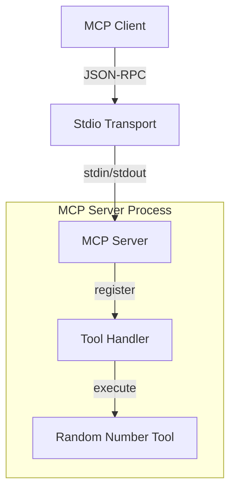
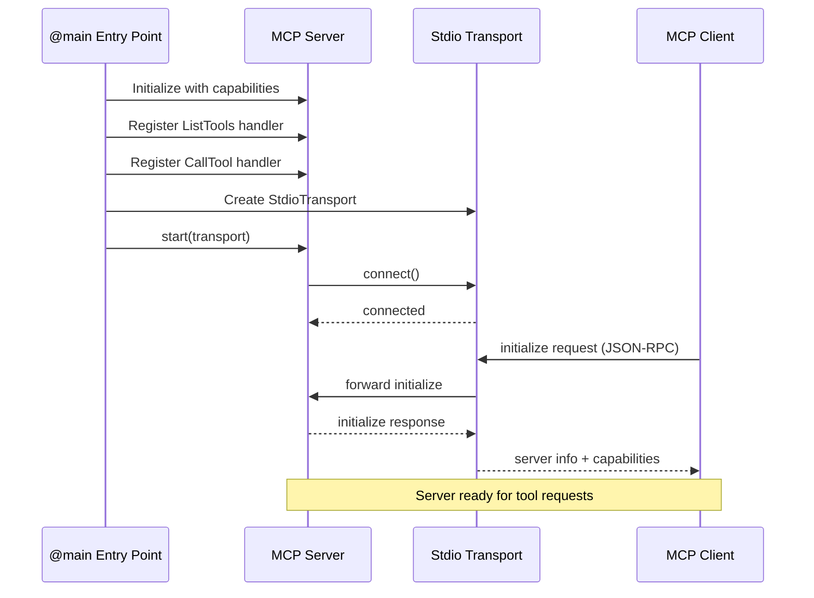
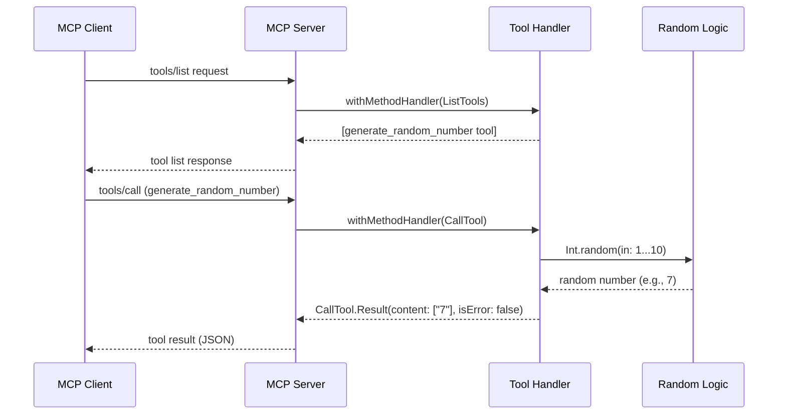

# Technical Design Document

## Overview

本設計は、Swift 6とMCP Swift SDKを使用した最小限の動作可能なMCPサーバーの実装を定義します。このプロジェクトはSwiftでのMCPサーバー開発のフィジビリティスタディであり、基本的なサーバー起動、JSON-RPC通信、ツール登録と実行の実装可能性を検証することを目的としています。

本設計は、[ClaudeSkills MCP Builder](https://claude-plugins.dev/skills/@AutumnsGrove/ClaudeSkills/mcp-builder)のベストプラクティスに準拠し、明確なツール命名、包括的な説明文、適切なエラーハンドリング、入力検証パターンを採用しています。

**Purpose**: Swift MCPサーバーの実装可能性を検証し、MCP Swift SDKの基本的な使用パターンを確立する。MCP Builder Best Practicesに準拠した実装パターンを確立する。

**Users**: 開発者がこのフィジビリティスタディを通じて、SwiftベースのMCPサーバー実装の実現可能性を評価し、将来の本格実装に向けた技術的知見を獲得する。

**Impact**: 新規プロジェクトとして、既存システムへの影響はない。成功により、SwiftでのMCPサーバー実装の技術的基盤が確立される。

### Goals

- MCP Swift SDK 0.10.0以上を使用したサーバーの基本構造実装
- 標準入出力（stdio）による JSON-RPC通信の確立
- 1つのテスト用ツール（`generate_random_number`）の実装と動作検証
- Swift Package Managerによる依存関係管理とビルド成功

### Non-Goals

- 複数ツールの本格実装
- HTTP/SSEトランスポートの実装
- 本番環境向けのエラーハンドリング・ロギング
- パフォーマンス最適化
- セキュリティ強化機能

## Architecture

### Architecture Pattern & Boundary Map



**Architecture Integration**:

- **Selected pattern**: Single Executable Server with Handler-based Tools
    - フィジビリティスタディに最適なシンプルな構造
    - MCP Swift SDK公式推奨パターンに準拠
- **Domain/feature boundaries**:
    - **Transport Layer**: 標準入出力によるMCPクライアントとの通信
    - **Server Core**: MCPプロトコルハンドリングとツール管理
    - **Tool Layer**: ツール実装とビジネスロジック
- **Existing patterns preserved**: N/A（新規プロジェクト）
- **New components rationale**:
    - **MCPServer**: MCPプロトコルの実装とライフサイクル管理
    - **ToolHandler**: ツールリスト提供とツール実行の委譲
    - **RandomTool**: 乱数生成ロジックのカプセル化
- **Steering compliance**:
    - ステアリングで定義されたMCPサーバー構造パターンに準拠
    - async/awaitパターンの一貫使用
    - Swift命名規則（PascalCase、camelCase）の遵守

### Technology Stack

| Layer | Choice / Version | Role in Feature | Notes |
|-------|------------------|-----------------|-------|
| Runtime | Swift 6.0 | 言語ランタイム | Xcode 16.1でコンパイル、strict concurrency対応 |
| MCP Protocol | MCP Swift SDK 0.10.0+ | MCPプロトコル実装 | 公式Swift SDK |
| Package Management | Swift Package Manager | 依存関係管理とビルド | Xcode統合、swift-tools-version: 6.0 |
| Transport | StdioTransport | 標準入出力通信 | MCP SDK組み込み、MCP Builder推奨 |
| Platform | macOS 15.0+ | 実行環境 | ステアリング要件に準拠 |
| Testing | Swift Testing | テストフレームワーク | Xcode 16標準、@Suite/@Test構文 |

## System Flows

### Server Startup Flow



**Key Decisions**:

- ハンドラー登録はサーバー起動前に完了
- エラーはthrowで伝播し、標準エラー出力に記録
- 初期化成功後、サーバーは無期限に実行継続

### Tool Execution Flow



**Key Decisions**:

- ツールリストは静的に定義（動的登録なし）
- 乱数生成はSwift標準ライブラリを使用
- エラーは`isError: true`フラグで表現

## Requirements Traceability

| Requirement | Summary | Components | Interfaces | Flows |
|-------------|---------|------------|------------|-------|
| 1.1 | サーバー起動とSDK初期化 | MCPServer, StdioTransport | Server.start() | Server Startup |
| 1.2 | 初期化リクエスト処理 | MCPServer | initialize handler | Server Startup |
| 1.3 | 起動エラー処理 | MCPServer, @main | Error throw | Server Startup |
| 1.4 | macOS 15.0互換性 | All | N/A | N/A |
| 1.5 | Swift 6.0コンパイル | All | N/A | N/A |
| 2.1 | SDK依存関係宣言 | Package.swift | N/A | N/A |
| 2.2 | macOS 15ターゲット指定 | Package.swift | N/A | N/A |
| 2.3 | 実行可能ターゲット定義 | Package.swift | N/A | N/A |
| 2.4 | ビルド成功 | Package.swift | N/A | N/A |
| 2.5 | バイナリ実行 | @main, MCPServer | N/A | Server Startup |
| 3.1 | generate_random_numberツール実装 | RandomNumberTool | Tool definition | Tool Execution |
| 3.2 | ツールリスト返却 | ListToolsHandler | ListTools handler | Tool Execution |
| 3.3 | ツール実行と乱数生成 | CallToolHandler, RandomNumberTool | CallTool handler | Tool Execution |
| 3.4 | パラメーターなし動作 | RandomNumberTool | Tool.inputSchema | Tool Execution |
| 3.5 | JSON形式レスポンス | CallToolHandler | CallTool.Result | Tool Execution |
| 3.6 | ツールエラー処理 | CallToolHandler | CallTool.Result | Tool Execution |
| 4.1 | Sources/WorkspaceMCP配置 | Directory structure | N/A | N/A |
| 4.2 | @mainエントリポイント | Main.swift | N/A | Server Startup |
| 4.3 | Swift命名規則 | All components | N/A | N/A |
| 4.4 | async/await使用 | MCPServer, Handlers | async functions | All flows |
| 4.5 | コンパイル警告対応 | All components | N/A | N/A |
| 5.1-5.5 | README.md文書化 | Documentation | N/A | N/A |
| 6.1-6.5 | 動作検証 | All components | All interfaces | All flows |

## Components and Interfaces

### Component Summary

| Component | Domain/Layer | Intent | Req Coverage | Key Dependencies (P0/P1) | Contracts |
|-----------|--------------|--------|--------------|--------------------------|-----------|
| Main | Entry Point | サーバー起動とライフサイクル管理 | 1.1, 1.3, 2.5, 4.2 | MCPServer (P0), StdioTransport (P0) | N/A |
| MCPServer | Server Core | MCPプロトコル処理とハンドラー管理 | 1.1, 1.2, 1.3 | MCP SDK (P0) | Service |
| ListToolsHandler | Tool Layer | 利用可能ツールリスト提供 | 3.2 | MCPServer (P0) | Service |
| CallToolHandler | Tool Layer | ツール実行委譲 | 3.3, 3.5, 3.6 | MCPServer (P0), RandomNumberTool (P0) | Service |
| RandomNumberTool | Tool Layer | 乱数生成ロジック | 3.1, 3.3, 3.4 | Swift stdlib (P0) | Service |
| Package.swift | Build Config | 依存関係とビルド設定 | 2.1, 2.2, 2.3, 2.4 | N/A | N/A |

### Server Core

#### MCPServer

| Field | Detail |
|-------|--------|
| Intent | MCPプロトコルの処理とツールハンドラーの管理 |
| Requirements | 1.1, 1.2, 1.3 |

**Responsibilities & Constraints**

- MCPプロトコルの初期化と通信管理
- ツールハンドラーの登録と実行委譲
- エラー処理と標準エラー出力へのログ記録
- Domain boundary: MCPプロトコルレイヤーとツールレイヤーの境界
- Transaction scope: 各リクエスト・レスポンスサイクル

**Dependencies**

- Outbound: MCP Swift SDK — MCPプロトコル実装 (P0)
- Outbound: StdioTransport — 標準入出力通信 (P0)
- Outbound: ListToolsHandler — ツールリスト提供 (P0)
- Outbound: CallToolHandler — ツール実行 (P0)

**Contracts**: Service [x]

##### Service Interface

```swift
import MCP

struct MCPServerConfig {
    let name: String
    let version: String
    let capabilities: ServerCapabilities
}

protocol MCPServerProtocol {
    func start(transport: Transport) async throws
    func stop() async
}

// 実装例（インターフェース定義のみ）
class MCPServerImpl: MCPServerProtocol {
    private let server: Server
    
    init(config: MCPServerConfig) {
        self.server = Server(
            name: config.name,
            version: config.version,
            capabilities: config.capabilities
        )
    }
    
    func start(transport: Transport) async throws {
        // ハンドラー登録
        // server.start()呼び出し
    }
    
    func stop() async {
        await server.stop()
    }
}
```

- **Preconditions**: ハンドラーが登録済みであること
- **Postconditions**: サーバーが起動し、クライアントリクエストを受信可能
- **Invariants**: 起動後はstop()が呼ばれるまで実行継続

**Implementation Notes**

- Integration: MCP SDK `Server`クラスをラップし、ライフサイクル管理を提供
- Validation: 起動時の設定検証はMCP SDKに委譲
- Risks: SDK更新によるAPI変更リスク（フィジビリティスタディでは許容）

### Tool Layer

#### ListToolsHandler

| Field | Detail |
|-------|--------|
| Intent | 利用可能なツールのリストをMCPクライアントに提供 |
| Requirements | 3.2 |

**Responsibilities & Constraints**

- `generate_random_number`ツールの定義を返す
- ツールメタデータ（name、description、inputSchema）の提供
- Domain boundary: ツール定義の一元管理

**Dependencies**

- Inbound: MCPServer — ハンドラー登録と実行 (P0)

**Contracts**: Service [x]

##### Service Interface

```swift
import MCP

typealias ListToolsHandler = (ListTools) async throws -> ListTools.Result

func createListToolsHandler() -> ListToolsHandler {
    return { _ in
        let tools = [
            Tool(
                name: "generate_random_number",
                description: "1から10の範囲の乱数を生成します",
                inputSchema: .object([:]) // パラメーターなし
            )
        ]
        return .init(tools: tools, nextCursor: nil)
    }
}
```

- **Preconditions**: なし（常に呼び出し可能）
- **Postconditions**: ツールリストが返される
- **Invariants**: ツールリストは静的（起動後変更なし）

**Implementation Notes**

- Integration: MCPServerの`withMethodHandler(ListTools.self)`で登録
- Validation: MCP SDKがスキーマ検証を実施
- Risks: なし

#### CallToolHandler

| Field | Detail |
|-------|--------|
| Intent | ツール実行リクエストを受け取り、対応するツールロジックを実行 |
| Requirements | 3.3, 3.5, 3.6 |

**Responsibilities & Constraints**

- ツール名に基づく実行ロジックの選択
- 乱数生成ロジックの呼び出し
- 結果のJSON形式フォーマット
- エラーハンドリングと`isError`フラグ設定
- Domain boundary: ツールルーティングとビジネスロジックの境界

**Dependencies**

- Inbound: MCPServer — ハンドラー登録と実行 (P0)
- Outbound: RandomNumberTool — 乱数生成 (P0)

**Contracts**: Service [x]

##### Service Interface

```swift
import MCP

typealias CallToolHandler = (CallTool) async throws -> CallTool.Result

func createCallToolHandler() -> CallToolHandler {
    return { params in
        switch params.name {
        case "generate_random_number":
            let randomNumber = generateRandomNumber()
            let jsonResult = "{\"result\": \(randomNumber)}"
            return .init(
                content: [.text(jsonResult)],
                isError: false
            )
        default:
            return .init(
                content: [.text("Unknown tool: \(params.name)")],
                isError: true
            )
        }
    }
}
```

- **Preconditions**: ツール名が有効であること（検証は実行時）
- **Postconditions**: ツール結果またはエラーが返される
- **Invariants**: すべてのリクエストに対してレスポンスを返す

**Implementation Notes**

- Integration: MCPServerの`withMethodHandler(CallTool.self)`で登録
- Validation: ツール名の存在チェックとエラーレスポンス
- Risks: 未知のツール名に対する適切なエラーレスポンス必須

#### RandomNumberTool

| Field | Detail |
|-------|--------|
| Intent | 1から10の範囲の乱数を生成 |
| Requirements | 3.1, 3.3, 3.4 |

**Responsibilities & Constraints**

- 1-10の整数乱数生成
- パラメーター不要の実装
- Domain boundary: 乱数生成ロジックのカプセル化

**Dependencies**

- Outbound: Swift stdlib — Int.random() (P0)

**Contracts**: Service [x]

##### Service Interface

```swift
func generateRandomNumber() -> Int {
    return Int.random(in: 1...10)
}
```

- **Preconditions**: なし
- **Postconditions**: 1から10の整数が返される
- **Invariants**: 常に1以上10以下の値

**Implementation Notes**

- Integration: CallToolHandlerから直接呼び出し
- Validation: Swift標準ライブラリが範囲保証
- Risks: なし（単純な関数呼び出し）

### Entry Point

#### Main

| Field | Detail |
|-------|--------|
| Intent | アプリケーションのエントリポイントとライフサイクル管理 |
| Requirements | 1.1, 1.3, 2.5, 4.2 |

**Responsibilities & Constraints**

- MCPServerの初期化
- ハンドラーの登録
- StdioTransportの作成
- サーバー起動とエラーハンドリング
- Domain boundary: アプリケーション起動とMCPサーバーコアの境界

**Dependencies**

- Outbound: MCPServer — サーバーライフサイクル (P0)
- Outbound: StdioTransport — 通信レイヤー (P0)
- Outbound: ListToolsHandler — ツールリスト (P0)
- Outbound: CallToolHandler — ツール実行 (P0)

**Contracts**: N/A（エントリポイント）

**Implementation Notes**

```swift
import MCP
import Foundation

@main
struct WorkspaceMCPServer {
    static func main() async {
        do {
            let server = Server(
                name: "WorkspaceMCP",
                version: "0.1.0",
                capabilities: .init(
                    tools: .init(listChanged: false)
                )
            )
            
            await server.withMethodHandler(ListTools.self, handler: createListToolsHandler())
            await server.withMethodHandler(CallTool.self, handler: createCallToolHandler())
            
            let transport = StdioTransport()
            try await server.start(transport: transport)
            
            // サーバー実行継続
            try await Task.sleep(for: .seconds(.max))
        } catch {
            fputs("Error: \(error.localizedDescription)\n", stderr)
            exit(1)
        }
    }
}
```

- Integration: MCP SDKのServerとTransportを直接使用
- Validation: エラーキャッチと標準エラー出力
- Risks: 無限ループでのリソース管理（フィジビリティスタディでは許容）

## Data Models

### Domain Model

**MCPサーバーの基本ドメインモデル**:

- **Tool**: ツール定義（name、description、inputSchema）
- **ToolResult**: ツール実行結果（content、isError）
- **ServerCapabilities**: サーバー能力宣言

本プロジェクトはMCP Swift SDKの型をそのまま使用し、独自のドメインモデルは定義しない。

### Data Contracts & Integration

#### Tool List Response

```json
{
  "tools": [
    {
      "name": "generate_random_number",
      "description": "1から10の範囲の乱数を生成します",
      "inputSchema": {
        "type": "object",
        "properties": {}
      }
    }
  ],
  "nextCursor": null
}
```

#### Tool Call Request

```json
{
  "name": "generate_random_number",
  "arguments": {}
}
```

#### Tool Call Response

```json
{
  "content": [
    {
      "type": "text",
      "text": "{\"result\": 7}"
    }
  ],
  "isError": false
}
```

## Error Handling

### Error Categories

| Category | Handling Strategy | Example |
|----------|------------------|---------|
| Server Startup Error | throw + stderr + exit(1) | MCP SDK初期化失敗 |
| Unknown Tool Error | isError: true in response | 存在しないツール名 |
| Tool Execution Error | isError: true in response | 乱数生成失敗（実際には発生しない） |

### Error Response Format

MCP Builder Best Practicesに準拠したエラーレスポンス:

```swift
// ✅ Good: 説明的なエラーメッセージと明示的なフラグ
CallTool.Result(
    content: [.text("Error: Unknown tool '\(toolName)'")],
    isError: true
)

// ❌ Bad: 曖昧なエラーメッセージ
CallTool.Result(
    content: [.text("Something went wrong")],
    isError: false  // フラグ忘れ
)
```

### Input Validation Pattern

本プロジェクトではパラメーターなしだが、将来の参考として:

```swift
// MCP Builder推奨パターン
guard let requiredParam = arguments["required_param"] as? String else {
    return CallTool.Result(
        content: [.text("Error: Missing required parameter 'required_param'")],
        isError: true
    )
}
```

## Best Practices (MCP Builder準拠)

### Tool Naming & Description

本プロジェクトはMCP Builder Best Practicesに準拠:

**Tool Name**: `generate_random_number`

- ✅ アクション指向の明確な命名
- ✅ アンダースコア区切りのスネークケース
- ✅ 何をするかが一目瞭然

**Description**: 「1から10の範囲の乱数を生成します。パラメーターは不要です。結果はJSON形式で返されます。」

- ✅ 何をするか明記
- ✅ パラメーター要件を説明
- ✅ 返り値の形式を説明

### Schema Design

```swift
// パラメーターなしでも明示的なスキーマ定義
Tool(
    name: "generate_random_number",
    description: "1から10の範囲の乱数を生成します",
    inputSchema: .object(properties: [:], required: [])  // 空でも明示
)
```

### Error Handling Best Practices

1. **エラーの分類**（本実装では簡略化）
2. **実行可能なエラーメッセージ**
3. **サイレントな失敗を避ける**
4. **isErrorフラグの明示的使用**

### Testing & Debugging

MCP Builderで推奨されるツール:

```bash
# MCP Inspectorでのテスト（本実装時）
npx @modelcontextprotocol/inspector swift run WorkspaceMCP
```

### Common Pitfalls回避

本プロジェクトで回避している落とし穴:

1. ✅ **絶対パス使用**: Package.swiftで明示的なパス指定
2. ✅ **明示的なエラーフラグ**: すべてのエラーレスポンスに`isError: true`
3. ✅ **説明的なメッセージ**: 汎用的な「エラーが発生しました」ではなく具体的な説明
4. ✅ **スキーマ定義**: パラメーターなしでも`inputSchema`を明示的に定義

## Testing Strategy

### Test Scope

本フィジビリティスタディでは、手動テストのみ実施:

1. **ビルドテスト**: `swift build`の成功確認
2. **起動テスト**: サーバー起動とMCPクライアント接続
3. **ツールリストテスト**: `tools/list`リクエストの成功確認
4. **ツール実行テスト**: `tools/call`リクエストと乱数レスポンスの確認
5. **範囲テスト**: 複数回実行し、1-10の範囲内の値が返されることを確認

### Future Testing

本格実装時にはSwift Testingによる以下のテストを追加:

**ハンドラーのユニットテスト**:

```swift
import Testing
@testable import WorkspaceMCP

@Suite("ListToolsHandler Tests")
struct ListToolsHandlerTests {
    
    @Test("returns generate_random_number tool")
    func listToolsReturnsRandomNumberTool() async throws {
        let handler = createListToolsHandler()
        let result = await handler(ListTools.Request(), ServerContext())
        
        #expect(result.tools.count == 1)
        #expect(result.tools[0].name == "generate_random_number")
    }
}
```

**ツール実行のユニットテスト**:

```swift
@Suite("CallToolHandler Tests")
struct CallToolHandlerTests {
    
    @Test("generates number in valid range")
    func generateRandomNumberInRange() async throws {
        let handler = createCallToolHandler()
        let request = CallTool.Request(
            name: "generate_random_number",
            arguments: [:]
        )
        let result = await handler(request, ServerContext())
        
        #expect(result.isError == false)
        #expect(!result.content.isEmpty)
        
        // 範囲検証（複数回実行）
        for _ in 0..<100 {
            let testResult = await handler(request, ServerContext())
            // JSON解析して1-10の範囲を確認
        }
    }
    
    @Test("returns error for unknown tool")
    func unknownToolReturnsError() async throws {
        let handler = createCallToolHandler()
        let request = CallTool.Request(
            name: "unknown_tool",
            arguments: [:]
        )
        let result = await handler(request, ServerContext())
        
        #expect(result.isError == true)
    }
}
```

**MCPプロトコルの統合テスト**:

```swift
@Suite("MCP Server Integration", .tags(.integration))
struct MCPServerIntegrationTests {
    
    @Test("server initializes with correct capabilities")
    func serverInitialization() {
        let server = Server(
            name: "WorkspaceMCP",
            version: "0.1.0",
            capabilities: .init(tools: .init(listChanged: false))
        )
        
        #expect(server.name == "WorkspaceMCP")
        #expect(server.version == "0.1.0")
    }
}
```

**エラーケースのテスト**:

```swift
@Suite("Error Handling Tests")
struct ErrorHandlingTests {
    
    @Test("invalid tool name returns descriptive error")
    func invalidToolNameError() async throws {
        let handler = createCallToolHandler()
        let request = CallTool.Request(name: "invalid", arguments: [:])
        let result = await handler(request, ServerContext())
        
        #expect(result.isError == true)
        #expect(result.content.first?.text?.contains("Unknown tool") == true)
    }
}
```

**テスト実行**:

```bash
# すべてのテスト実行
swift test

# 特定のスイート実行
swift test --filter ListToolsHandlerTests

# 統合テストのみ実行
swift test --filter "tag:integration"
```

## Security Considerations

本フィジビリティスタディでは、以下のセキュリティ考慮事項は対象外:

- 入力検証（パラメーターなしのため不要）
- 認証・認可
- レート制限
- ログ監査

## Performance Considerations

本フィジビリティスタディでは、パフォーマンス最適化は対象外。基本的な動作確認のみ実施。

## Deployment & Operations

### Build

```bash
swift build -c release
```

### Run

```bash
.build/release/WorkspaceMCP
```

### Dependencies

MCP Swift SDK 0.10.0以上のインストールはSPMが自動で実施。

## Supporting References

### Package.swift Configuration

```swift
// swift-tools-version: 6.0
import PackageDescription

let package = Package(
    name: "WorkspaceMCP",
    platforms: [.macOS(.v15)],
    dependencies: [
        .package(url: "https://github.com/modelcontextprotocol/swift-sdk", from: "0.10.0")
    ],
    targets: [
        .executableTarget(
            name: "WorkspaceMCP",
            dependencies: [
                .product(name: "MCP", package: "swift-sdk")
            ],
            path: "Sources/WorkspaceMCP",
            swiftSettings: [
                .enableUpcomingFeature("StrictConcurrency")
            ]
        )
    ]
)
```

### Directory Structure

```
WorkspaceMCP/
├── Package.swift
├── README.md
└── Sources/
    └── WorkspaceMCP/
        └── Main.swift
```

## Open Questions & Risks

### Open Questions

1. MCP Swift SDK 0.10.2の長期サポート状況は？
   - **Resolution**: フィジビリティスタディのため、現時点での最新版を使用
2. ツール実行時のタイムアウト設定は必要か？
   - **Resolution**: 乱数生成は瞬時のため、本実装では不要

### Risks

| Risk | Impact | Mitigation |
|------|--------|-----------|
| MCP SDK APIの将来的な変更 | 中 | フィジビリティスタディのため許容、本実装時に再評価 |
| macOS 15以降での動作保証 | 低 | MCP SDK公式サポート範囲内 |
| 標準入出力のバッファリング問題 | 低 | StdioTransportがハンドリング |

---

**Document Version**: 1.0  
**Last Updated**: 2025-12-07  
**Status**: Design Generated
