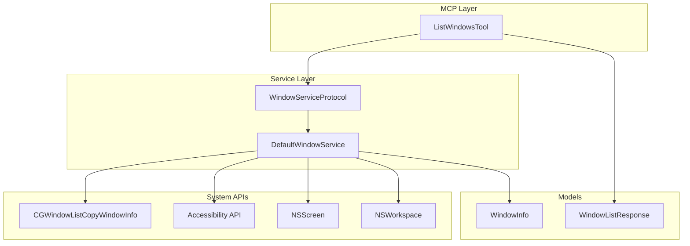
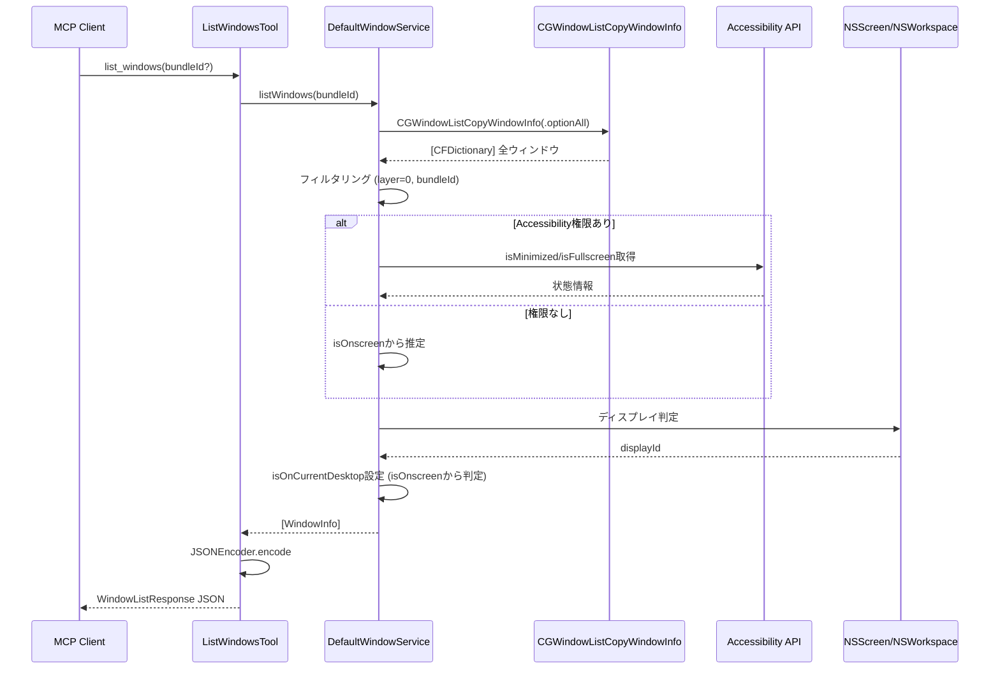
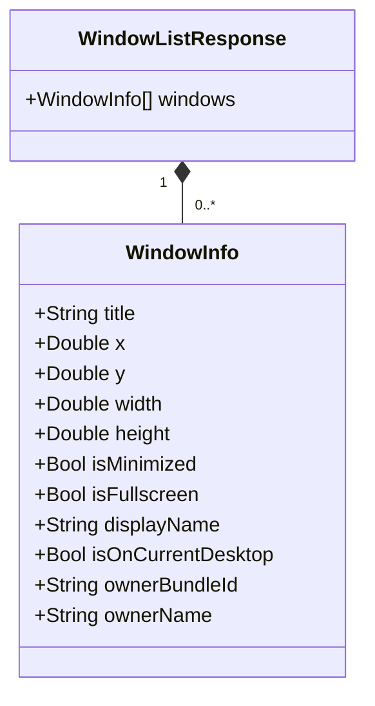

# Design Document: multi-desktop-window-query

## Overview

**Purpose**: この機能は、macOS上の複数デスクトップ（Spaces）にまたがる全ウィンドウの情報をMCPクライアント（Claude）に提供する。

**Users**: Claudeユーザーがウィンドウ配置の把握、操作対象の特定、ワークスペース管理の意思決定に使用する。

**Impact**: 既存のWindowServiceをCGWindowList APIベースに拡張し、現在のデスクトップ制限を解消する。

### Goals
- 全デスクトップ（Spaces）のウィンドウ情報を取得可能にする
- 既存のWindowInfo/WindowListResponseデータ構造を維持しつつisOnCurrentDesktopを追加
- Accessibility権限なしでも基本機能が動作する

### Non-Goals
- ウィンドウの移動・リサイズ操作（別機能）
- 正確なSpace ID取得（macOS公開API制限により不可）
- リアルタイム監視・イベント通知

## Architecture

### Existing Architecture Analysis

現在のWindowServiceは以下の構造:

- `WindowServiceProtocol`: ウィンドウ操作の抽象インターフェース
- `DefaultWindowService`: Accessibility API使用の実装
- `ListWindowsTool`: MCPツールラッパー
- `WindowInfo`: ウィンドウ情報モデル（isOnCurrentDesktopなし）

**制約**:
- Accessibility APIは現在のSpaceのウィンドウのみ取得
- 権限チェックが必須（AXIsProcessTrusted）

**維持すべきパターン**:
- Protocol/Default実装の分離
- Codable準拠のモデル
- JSONEncoder使用のレスポンス生成

### Architecture Pattern & Boundary Map



**Architecture Integration**:
- Selected pattern: ハイブリッドアプローチ（CGWindowList + Accessibility API）
- Domain boundaries: WindowService内で2つのAPIを統合、外部インターフェースは変更なし
- Existing patterns preserved: Protocol/実装分離、MCPTool構造、Codableモデル
- New components rationale: 新規コンポーネントなし、既存拡張のみ
- Steering compliance: macos-automation.mdのService分離原則に準拠

### Technology Stack

| Layer | Choice / Version | Role in Feature | Notes |
|-------|------------------|-----------------|-------|
| Backend / Services | Swift 6.0 | WindowService拡張実装 | 既存スタック |
| System API | CoreGraphics (CGWindowList) | 全デスクトップウィンドウ取得 | 新規使用 |
| System API | ApplicationServices (AX) | 状態情報補完 | 既存継続 |
| System API | AppKit (NSScreen, NSWorkspace) | ディスプレイ/プロセス情報 | 既存継続 |

## System Flows

### ウィンドウ情報取得フロー



**Key Decisions**:
- CGWindowListを先に呼び出し、全ウィンドウの基本情報を取得
- Accessibility APIは状態補完のみに使用（権限依存を最小化）
- isOnCurrentDesktopはkCGWindowIsOnscreenフラグから判定

## Requirements Traceability

| Requirement | Summary | Components | Interfaces | Flows |
|-------------|---------|------------|------------|-------|
| 1.1 | 全デスクトップウィンドウ取得 | DefaultWindowService | listWindows | 取得フロー |
| 1.2 | bundleIdフィルタリング | DefaultWindowService | listWindows | 取得フロー |
| 1.3 | bundleId省略時全アプリ | DefaultWindowService | listWindows | 取得フロー |
| 1.4-1.9 | ウィンドウ属性含める（displayName, isOnCurrentDesktop含む） | WindowInfo | プロパティ | - |
| 2.1 | Codable準拠WindowInfo | WindowInfo | struct定義 | - |
| 2.2 | プロパティ定義 | WindowInfo | プロパティ | - |
| 2.3 | WindowListResponseラップ | WindowListResponse | struct定義 | - |
| 2.4 | JSONEncoder使用 | ListWindowsTool | execute | 取得フロー |
| 3.1 | CGWindowListCopyWindowInfo使用 | DefaultWindowService | 内部実装 | 取得フロー |
| 3.2 | optionAllオプション | DefaultWindowService | 内部実装 | 取得フロー |
| 3.3 | kCGWindowBounds抽出 | DefaultWindowService | 内部実装 | 取得フロー |
| 3.4 | PIDからbundleId解決 | DefaultWindowService | 内部実装 | 取得フロー |
| 3.5 | タイトルなし時空文字列 | DefaultWindowService | 内部実装 | - |
| 4.1 | isOnCurrentDesktop付与 | WindowInfo, DefaultWindowService | プロパティ | 取得フロー |
| 4.2 | isOnscreenから判定 | DefaultWindowService | 内部実装 | - |
| 4.3 | 複数ディスプレイでdisplayName設定 | DefaultWindowService | 内部実装 | 取得フロー |
| 5.1 | nil時空リスト | DefaultWindowService | listWindows | - |
| 5.2 | 該当なし時空リスト | DefaultWindowService | listWindows | - |
| 5.3 | 権限なし動作 | DefaultWindowService | 内部実装 | - |

## Components and Interfaces

| Component | Domain/Layer | Intent | Req Coverage | Key Dependencies | Contracts |
|-----------|--------------|--------|--------------|------------------|-----------|
| WindowInfo | Models/Window | ウィンドウ情報データモデル（displayName, isOnCurrentDesktop含む） | 1.4-1.9, 2.1, 2.2, 4.1 | なし | State |
| WindowListResponse | Models/Window | レスポンスラッパー | 2.3 | WindowInfo (P0) | State |
| DefaultWindowService | Services | ウィンドウ情報取得ロジック | 1.1-1.3, 3.1-3.5, 4.1-4.3, 5.1-5.3 | CGWindowList (P0), AX API (P1), NSScreen (P1) | Service |
| ListWindowsTool | Tools | MCPツールラッパー | 2.4 | WindowService (P0) | Service |

### Models / Window

#### WindowInfo

| Field | Detail |
|-------|--------|
| Intent | ウィンドウの属性情報を保持するCodable準拠データモデル（displayName, isOnCurrentDesktop含む） |
| Requirements | 1.4, 1.5, 1.6, 1.7, 1.8, 1.9, 2.1, 2.2, 4.1, 4.2 |

**Responsibilities & Constraints**
- 単一ウィンドウの全属性を保持
- イミュータブル（let プロパティ）
- Sendable準拠（Swift 6並行性対応）

**Dependencies**
- なし

**Contracts**: State [x]

##### State Management

```swift
public struct WindowInfo: Sendable, Codable {
    public let title: String
    public let x: Double
    public let y: Double
    public let width: Double
    public let height: Double
    public let isMinimized: Bool
    public let isFullscreen: Bool
    public let displayName: String           // displayIdから名称変更
    public let isOnCurrentDesktop: Bool      // 新規追加（desktopIdから変更、Bool型）
    public let ownerBundleId: String
    public let ownerName: String
}
```

- State model: イミュータブル値型
- Persistence: なし（一時的なスナップショット）
- Concurrency: Sendable準拠により安全

**Implementation Notes**
- Integration: 既存WindowInfoのdisplayIdをdisplayNameに改名、isOnCurrentDesktopプロパティを追加
- Validation: isOnCurrentDesktopはkCGWindowIsOnscreenから直接マッピング
- Risks: 既存コードでWindowInfo生成箇所の修正が必要（displayId→displayName、isOnCurrentDesktop追加）

### Services

#### DefaultWindowService

| Field | Detail |
|-------|--------|
| Intent | CGWindowList APIを使用して全デスクトップのウィンドウ情報を取得 |
| Requirements | 1.1, 1.2, 1.3, 3.1, 3.2, 3.3, 3.4, 3.5, 4.1, 4.2, 4.3, 5.1, 5.2, 5.3 |

**Responsibilities & Constraints**
- CGWindowListCopyWindowInfoで全ウィンドウ取得
- bundleIdによるフィルタリング
- Accessibility APIで状態情報を補完（権限がある場合）
- ディスプレイ・デスクトップ識別子の付与

**Dependencies**
- External: CoreGraphics (CGWindowListCopyWindowInfo) — ウィンドウ一覧取得 (P0)
- External: ApplicationServices (Accessibility API) — 状態情報取得 (P1)
- External: AppKit (NSScreen) — ディスプレイ情報 (P1)
- External: AppKit (NSWorkspace) — プロセス情報 (P1)

**Contracts**: Service [x]

##### Service Interface

```swift
public protocol WindowServiceProtocol: Sendable {
    /// ウィンドウ情報を取得する
    /// - Parameter bundleId: フィルタリング対象のbundle ID（nilで全アプリ）
    /// - Returns: ウィンドウ情報の配列
    func listWindows(bundleId: String?) async throws -> [WindowInfo]

    /// Accessibility権限を確認する
    /// - Returns: 権限が付与されているかどうか
    func checkAccessibilityPermission() -> Bool
}
```

- Preconditions: なし（権限なしでも動作）
- Postconditions:
  - 成功時: 0個以上のWindowInfoを返却
  - bundleId指定時: 該当アプリのウィンドウのみ
  - CGWindowListがnil時: 空配列
- Invariants: 返却されるWindowInfoは有効なデータを持つ

**Implementation Notes**
- Integration:
  - `CGWindowListCopyWindowInfo(.optionAll, kCGNullWindowID)`で全ウィンドウ取得
  - `kCGWindowLayer == 0`でシステムウィンドウ除外
  - `CGRect(dictionaryRepresentation:)`でbounds変換
- Validation:
  - bundleIdは空文字列の場合nilとして扱う
  - kCGWindowOwnerPIDからNSRunningApplicationを解決
- Risks:
  - 大量ウィンドウ時のパフォーマンス（フィルタリングで緩和）
  - macOSバージョン間の動作差異

## Data Models

### Domain Model



**Business Rules & Invariants**:
- title: 空文字列許容（無題ウィンドウ）
- x, y: Core Graphics座標系（左上原点）
- width, height: 0より大きい値
- displayName: NSScreen.localizedNameまたは"Unknown"
- isOnCurrentDesktop: kCGWindowIsOnscreenの値（現在Spaceに表示中ならtrue）

### Logical Data Model

**Structure Definition**:
- WindowInfo: 1:1でシステムウィンドウにマッピング
- WindowListResponse: 1:N（1レスポンスに複数ウィンドウ）

**Indexing/Filtering**:
- bundleIdによるフィルタリング（アプリケーション単位）
- kCGWindowLayerによるシステムウィンドウ除外

### Data Contracts & Integration

**API Data Transfer**:
- Request: `{ "bundleId"?: string }`
- Response: `{ "windows": WindowInfo[] }`
- Serialization: JSON (UTF-8, prettyPrinted, sortedKeys)

## Error Handling

### Error Strategy

CGWindowList APIベースのため、Accessibility権限エラーは発生しない設計。エラーは最小化し、空リストで対応。

### Error Categories and Responses

**System Errors**:
- CGWindowListCopyWindowInfo nil → 空のWindowInfo配列を返却
- NSRunningApplication解決失敗 → 該当ウィンドウをスキップ

**Business Logic**:
- 指定bundleIdのアプリが見つからない → 空配列（エラーではない）

### Monitoring

- ログ: ウィンドウ取得数、フィルタリング結果
- メトリクス: API呼び出し時間（パフォーマンス監視用）

## Testing Strategy

### Unit Tests
- WindowInfo isOnCurrentDesktopプロパティの追加確認
- WindowInfo displayIdからdisplayNameへの改名確認
- CGWindowList辞書からWindowInfo変換ロジック
- bundleIdフィルタリングロジック
- ディスプレイ判定ロジック
- isOnCurrentDesktop設定ロジック（kCGWindowIsOnscreen判定）

### Integration Tests
- CGWindowListCopyWindowInfo実呼び出しとパース
- Accessibility API併用時の状態取得
- 複数ディスプレイ環境でのdisplayId判定

### E2E Tests
- MCPクライアントからのlist_windows呼び出し
- JSON形式レスポンスの検証
- bundleIdパラメーター有無での動作確認

## Optional Sections

### Performance & Scalability

**Target Metrics**:
- ウィンドウ100個以下: 100ms以内
- ウィンドウ500個以下: 500ms以内

**Optimization**:
- 早期フィルタリング（layer, bundleId）でループ回数削減
- Accessibility API呼び出しは権限確認後のみ
