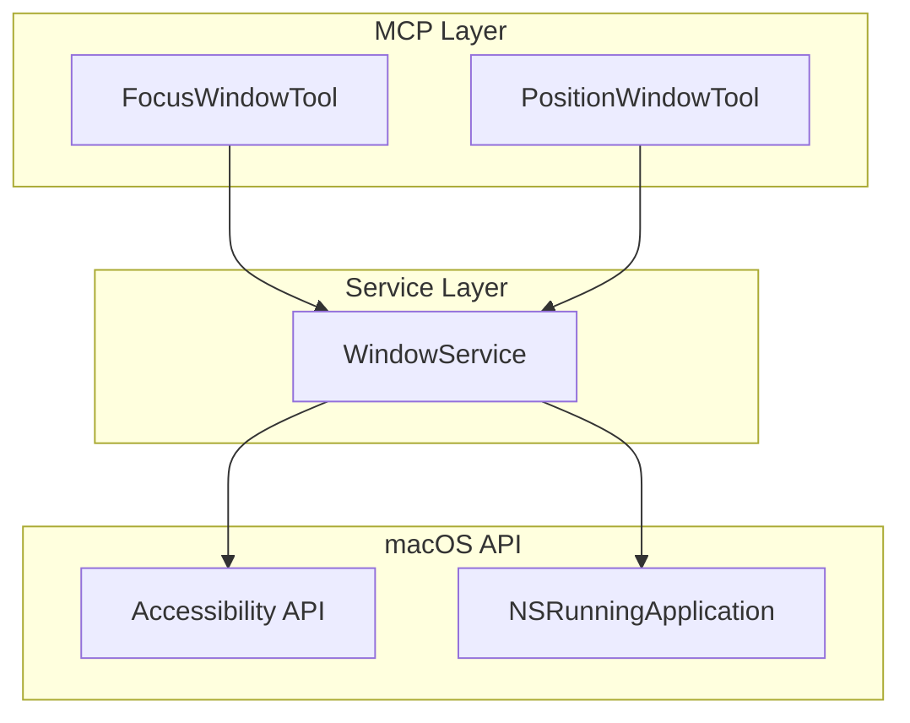
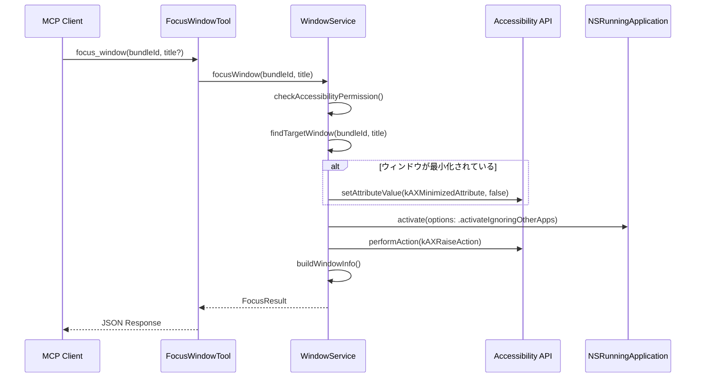

# Technical Design: window-focus

## Overview

**Purpose**: 本機能は、指定されたウィンドウを最前面に表示（フォーカス）する機能を提供する。

**Users**: MCPクライアント（Claude等）がウィンドウ操作を行う際に利用する。

**Impact**: 既存のWindowServiceProtocolにfocusWindowメソッドを追加し、positionWindow完了後の自動前面表示機能を追加する。

### Goals
- bundle ID指定でアプリケーションのウィンドウを最前面に表示
- オプションでウィンドウタイトルによるフィルタリング
- positionWindow成功後の自動前面表示
- 最小化されたウィンドウの自動解除

### Non-Goals
- 複数ウィンドウの同時前面表示
- ウィンドウのZオーダー制御
- 他アプリケーションのウィンドウを背面に移動する機能

## Architecture

### Existing Architecture Analysis

現在のWindowServiceは以下の機能を提供:
- `listWindows`: ウィンドウ一覧取得
- `positionWindow`: ウィンドウ配置
- `checkAccessibilityPermission`: 権限確認

既存パターン:
- プロトコル + デフォルト実装パターン（`WindowServiceProtocol` + `DefaultWindowService`）
- Accessibility APIを使用したウィンドウ操作
- 内部ヘルパー（`findTargetWindow`, `buildWindowInfo`）の再利用

### Architecture Pattern & Boundary Map



**Architecture Integration**:
- Selected pattern: 既存WindowService拡張
- Domain boundaries: ウィンドウ操作はWindowServiceの責務範囲内
- Existing patterns preserved: プロトコル + デフォルト実装、MCPToolパターン
- New components: FocusWindowTool（新規ツール）、focusWindowメソッド（WindowService拡張）
- Steering compliance: macos-automation.mdのドメインベースサービス分離に準拠

### Technology Stack

| Layer | Choice / Version | Role in Feature | Notes |
|-------|------------------|-----------------|-------|
| Services | Swift 6.0 / Accessibility API | ウィンドウ前面表示操作 | kAXRaiseAction使用 |
| Services | AppKit / NSRunningApplication | アプリケーションアクティブ化 | activate()メソッド |
| Tools | MCP Swift SDK 0.10.0+ | MCPツールインターフェース | 既存パターン継承 |

## System Flows

### ウィンドウ前面表示フロー



## Requirements Traceability

| Requirement | Summary | Components | Interfaces | Flows |
|-------------|---------|------------|------------|-------|
| 1.1 | bundle IDでウィンドウ前面表示 | WindowService, FocusWindowTool | focusWindow | 前面表示フロー |
| 1.2 | タイトルフィルタリング | WindowService | focusWindow | 前面表示フロー |
| 1.3 | applicationNotFoundエラー | WindowService | focusWindow | - |
| 1.4 | windowNotFoundエラー | WindowService | focusWindow | - |
| 1.5 | permissionDeniedエラー | WindowService | focusWindow | - |
| 2.1 | positionWindow後の前面表示 | WindowService | positionWindow | 配置フロー |
| 2.2 | 最小化解除 | WindowService | focusWindow, positionWindow | 前面表示フロー |
| 3.1 | ツール登録 | ToolRegistry, FocusWindowTool | - | - |
| 3.2 | パラメーター定義 | FocusWindowTool | definition | - |
| 3.3 | サービス呼び出し | FocusWindowTool | execute | 前面表示フロー |
| 3.4 | JSON応答 | FocusWindowTool | execute | - |
| 3.5 | エラー応答 | FocusWindowTool | execute | - |

## Components and Interfaces

| Component | Domain/Layer | Intent | Req Coverage | Key Dependencies | Contracts |
|-----------|--------------|--------|--------------|-----------------|-----------|
| WindowServiceProtocol | Service | ウィンドウ前面表示操作 | 1.1-1.5, 2.1-2.2 | Accessibility API (P0), NSRunningApplication (P0) | Service |
| FocusWindowTool | Tool | MCPツールインターフェース | 3.1-3.5 | WindowService (P0) | Service |
| FocusResult | Model | フォーカス結果データ | 3.4 | WindowInfo (P0) | - |

### Service Layer

#### WindowServiceProtocol（拡張）

| Field | Detail |
|-------|--------|
| Intent | ウィンドウの前面表示操作を提供 |
| Requirements | 1.1, 1.2, 1.3, 1.4, 1.5, 2.1, 2.2 |

**Responsibilities & Constraints**
- ウィンドウの前面表示操作
- 最小化されたウィンドウの自動解除
- 既存の位置・サイズ操作との整合性維持

**Dependencies**
- External: Accessibility API — ウィンドウ操作 (P0)
- External: NSRunningApplication — アプリアクティブ化 (P0)

**Contracts**: Service [x]

##### Service Interface

```swift
public protocol WindowServiceProtocol: Sendable {
    // 既存メソッド省略...

    /// ウィンドウを最前面に表示する
    /// - Parameters:
    ///   - bundleId: 対象アプリケーションのbundle ID
    ///   - title: ウィンドウタイトル（オプション、フィルタリング用）
    /// - Returns: フォーカス結果
    /// - Throws: WorkspaceError
    func focusWindow(
        bundleId: String,
        title: String?
    ) async throws -> FocusResult
}
```

- Preconditions: Accessibility権限が必要
- Postconditions: 指定ウィンドウが最前面に表示される
- Invariants: アプリケーションがアクティブ状態になる

**Implementation Notes**
- Integration: 既存の`findTargetWindow`ヘルパーを再利用
- Validation: 権限チェック、アプリ存在確認、ウィンドウ存在確認
- Risks: 一部アプリでkAXRaiseActionがサポートされない可能性（フォールバック対応）

### Tool Layer

#### FocusWindowTool

| Field | Detail |
|-------|--------|
| Intent | focus_window MCPツールの実装 |
| Requirements | 3.1, 3.2, 3.3, 3.4, 3.5 |

**Responsibilities & Constraints**
- MCPパラメーターのデコードとバリデーション
- WindowServiceの呼び出しとエラーハンドリング
- 結果のJSON変換

**Dependencies**
- Inbound: ToolRegistry — ツール呼び出し (P0)
- Outbound: WindowService — ウィンドウ操作 (P0)

**Contracts**: Service [x]

##### Service Interface

```swift
public struct FocusWindowTool: MCPTool {
    static let name = "focus_window"
    static let definition: Tool

    func execute(arguments: [String: Value]) async -> CallTool.Result
}

struct Input: Decodable {
    let bundleId: String?  // 必須
    let title: String?     // オプション
}
```

- Preconditions: bundleIdパラメーターが必須
- Postconditions: 成功時はFocusResultをJSON形式で返却
- Error Response: isError: true + 日本語エラーメッセージ

**Tool Definition**:
```swift
Tool(
    name: "focus_window",
    description: """
    指定されたアプリケーションのウィンドウを最前面に表示します。
    アプリケーションをアクティブ化し、ウィンドウにフォーカスを当てます。
    最小化されているウィンドウは自動的に復元されます。
    """,
    inputSchema: .object(
        properties: [
            "bundleId": .string(description: "対象アプリケーションのbundle ID（例: com.apple.Safari）"),
            "title": .string(description: "ウィンドウタイトル（部分一致、オプション）")
        ],
        required: ["bundleId"]
    )
)
```

**Implementation Notes**
- Integration: MCPArgumentDecoder + MCPResultEncoderパターン使用
- Validation: bundleId必須チェック、空文字列チェック
- Risks: なし

## Data Models

### Domain Model

#### FocusResult

```swift
public struct FocusResult: Sendable, Codable {
    /// フォーカスしたウィンドウの情報
    public let window: WindowInfo

    public init(window: WindowInfo) {
        self.window = window
    }
}
```

**Invariants**:
- windowは常に有効なWindowInfoを持つ

### Data Contracts & Integration

**API Data Transfer**:
- Request: `{ "bundleId": "com.apple.Safari", "title": "Google" }`
- Response: `{ "window": { ...WindowInfo... } }`
- Serialization: JSON (MCPResultEncoder使用)

## Error Handling

### Error Categories and Responses

**User Errors (4xx相当)**:
- `applicationNotFound`: 指定されたbundle IDのアプリが見つからない
- `windowNotFound`: 指定条件に一致するウィンドウが見つからない

**System Errors (5xx相当)**:
- `permissionDenied`: Accessibility権限がない
- `focusFailed`: 前面表示操作に失敗

### Error Response Pattern

```swift
// WorkspaceErrorに追加
case focusFailed(reason: String)

var userMessage: String {
    switch self {
    case .focusFailed(let reason):
        return "ウィンドウの前面表示に失敗しました: \(reason)"
    // ...
    }
}
```

## Testing Strategy

### Unit Tests
- focusWindow: bundle ID指定で正常にフォーカスできることを確認
- focusWindow: タイトル指定でフィルタリングが動作することを確認
- focusWindow: 存在しないアプリでapplicationNotFoundエラーを返すことを確認
- focusWindow: 権限がない場合にpermissionDeniedエラーを返すことを確認
- FocusWindowTool: bundleId必須バリデーションが動作することを確認

### Integration Tests
- positionWindow後にウィンドウが前面表示されることを確認
- 最小化されたウィンドウが解除されて前面表示されることを確認

### E2E Tests (CI環境では無効)
- 実際のアプリケーションでfocus_windowツールが動作することを確認
