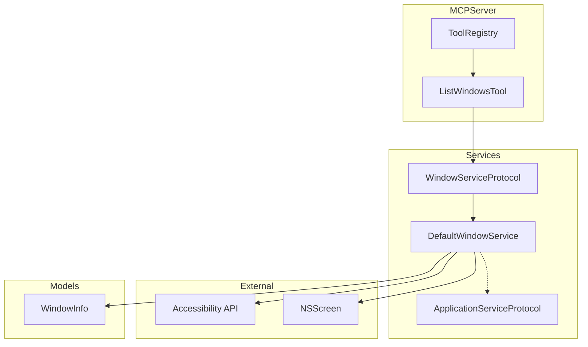
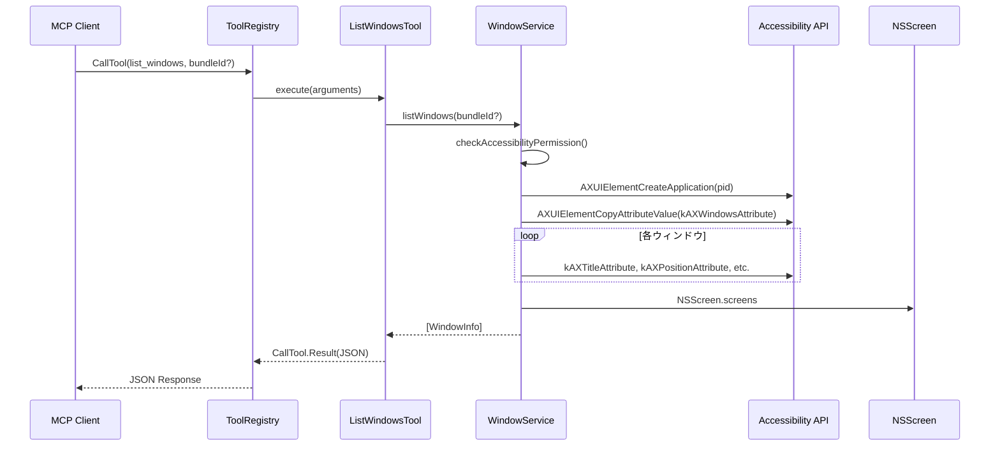

# Design Document

## Overview

**Purpose**: 本機能は、ユーザーがClaudeを通じてmacOSアプリケーションのウィンドウ情報を取得できるようにする。ウィンドウのタイトル、位置、サイズ、表示状態、所属ディスプレイを一覧形式で返却する。

**Users**: Claudeユーザーがワークスペース管理やウィンドウ配置の把握のために利用する。

**Impact**: 新規`WindowServiceProtocol`を作成し、MCPツール`list_windows`を追加する。ApplicationServiceとは独立したサービスとして実装する。

### Goals
- 特定アプリまたは全アプリのウィンドウ情報を取得可能にする
- タイトル、位置、サイズ、最小化/フルスクリーン状態、ディスプレイ識別子を返却する
- 既存のMCPツールパターン（Tool-per-File）に準拠する
- ウィンドウ管理の責務をWindowServiceに分離する

### Non-Goals
- ウィンドウの移動・リサイズ操作（別機能として実装予定）
- リアルタイムなウィンドウ変更監視
- 非表示ウィンドウやシステムウィンドウの取得

## Architecture

### Existing Architecture Analysis

既存システムは以下のパターンを採用している:
- **MCPTool Protocol**: `name`, `definition`, `execute(arguments:)`を定義
- **ToolRegistry**: ツール登録とCallToolハンドラーによるルーティング
- **ApplicationServiceProtocol**: アプリケーション制御の抽象化レイヤー
- **Tool-per-File Pattern**: 1ツール1ファイルで管理

これらのパターンを維持しながら、新規`WindowServiceProtocol`を追加する。

### Architecture Pattern & Boundary Map



**Architecture Integration**:
- Selected pattern: 新規WindowServiceによる責務分離
- Domain/feature boundaries: WindowServiceがウィンドウ操作を担当、ApplicationServiceはアプリ操作を担当
- Existing patterns preserved: MCPTool Protocol、Tool-per-File、DI via Protocol
- New components rationale:
  - WindowServiceProtocol/DefaultWindowService: ウィンドウ専用サービス
  - ListWindowsTool: MCPツール
  - WindowInfo: ウィンドウデータモデル
- Steering compliance: macos-automation.mdのAccessibility APIパターンとサービス分離パターンに準拠

### Technology Stack

| Layer | Choice / Version | Role in Feature | Notes |
|-------|------------------|-----------------|-------|
| Backend / Services | Swift 6.0 | ツール実装、サービスロジック | strict concurrency対応 |
| Infrastructure / Runtime | macOS 15+ | Accessibility API、NSScreen | Accessibility権限必須 |
| Data / Storage | - | 状態保持なし | ステートレス設計 |

## System Flows

### ウィンドウ情報取得フロー



**Key Decisions**:
- bundleId指定時は該当アプリのみ、省略時は全アプリを対象
- ディスプレイ識別はウィンドウ中心点とNSScreen.frameの包含判定
- WindowServiceは独自にAccessibility権限チェックを実行

## Requirements Traceability

| Requirement | Summary | Components | Interfaces | Flows |
|-------------|---------|------------|------------|-------|
| 1.1 | ウィンドウ情報取得ツール呼び出し | ListWindowsTool, WindowService | listWindows() | 取得フロー |
| 1.2 | bundleID指定フィルタリング | WindowService | listWindows(bundleId:) | 取得フロー |
| 1.3 | 全アプリウィンドウ取得 | WindowService | listWindows(bundleId: nil) | 取得フロー |
| 2.1 | ウィンドウタイトル | WindowInfo | title: String | - |
| 2.2 | 位置情報 | WindowInfo | x: Double, y: Double | - |
| 2.3 | サイズ情報 | WindowInfo | width: Double, height: Double | - |
| 2.4 | 最小化状態 | WindowInfo | isMinimized: Bool | - |
| 2.5 | フルスクリーン状態 | WindowInfo | isFullscreen: Bool | - |
| 2.6 | ディスプレイ識別子 | WindowInfo, WindowService | displayId: String | - |
| 3.1 | アプリ未検出エラー | ListWindowsTool | CallTool.Result(isError: true) | - |
| 3.2 | 権限エラー | WindowService | WorkspaceError.permissionDenied | - |
| 3.3 | ウィンドウなし | ListWindowsTool | 空配列を返却 | - |
| 4.1 | ツール名 | ListWindowsTool | name = "list_windows" | - |
| 4.2 | ツール説明 | ListWindowsTool | definition.description | - |
| 4.3 | bundleIdパラメーター | ListWindowsTool | inputSchema | - |
| 4.4 | 成功レスポンス | ListWindowsTool | JSON配列 | - |
| 4.5 | エラーレスポンス | ListWindowsTool | isError: true | - |

## Components and Interfaces

| Component | Domain/Layer | Intent | Req Coverage | Key Dependencies | Contracts |
|-----------|--------------|--------|--------------|------------------|-----------|
| ListWindowsTool | Tools | MCPツールエントリポイント | 1.1, 3.1, 3.3, 4.1-4.5 | WindowService (P0) | Service |
| WindowServiceProtocol | Services | ウィンドウ取得ロジックの抽象化 | 1.2, 1.3, 2.1-2.6, 3.2 | - | Service |
| DefaultWindowService | Services | WindowServiceProtocolの実装 | 1.2, 1.3, 2.1-2.6, 3.2 | Accessibility API (P0), NSScreen (P1) | Service |
| WindowInfo | Models | ウィンドウデータモデル | 2.1-2.6 | なし | - |

### Tools Layer

#### ListWindowsTool

| Field | Detail |
|-------|--------|
| Intent | MCPツール`list_windows`のエントリポイント、パラメーター解析とレスポンス生成 |
| Requirements | 1.1, 3.1, 3.3, 4.1, 4.2, 4.3, 4.4, 4.5 |

**Responsibilities & Constraints**
- bundleIdパラメーターの検証（オプショナル）
- WindowServiceへの委譲
- JSON形式でのレスポンス生成

**Dependencies**
- Inbound: ToolRegistry — CallToolルーティング (P0)
- Outbound: WindowServiceProtocol — ウィンドウ取得 (P0)

**Contracts**: Service [x]

##### Service Interface

```swift
public struct ListWindowsTool: MCPTool {
    public static let name: String = "list_windows"
    public static let definition: Tool

    public init(service: WindowServiceProtocol)
    public func execute(arguments: [String: Any]) async -> CallTool.Result
}
```

- Preconditions: なし（bundleIdはオプショナル）
- Postconditions: JSON配列または`isError: true`を返却
- Invariants: 常にCallTool.Resultを返す

**Implementation Notes**
- Integration: ToolRegistryの`registeredTools`と`handleCallTool`に追加
- Validation: bundleIdは文字列型チェックのみ、空文字は全アプリ扱い
- Risks: なし

### Services Layer

#### WindowServiceProtocol

| Field | Detail |
|-------|--------|
| Intent | ウィンドウ操作に関する抽象化レイヤー |
| Requirements | 1.2, 1.3, 2.1, 2.2, 2.3, 2.4, 2.5, 2.6, 3.2 |

**Responsibilities & Constraints**
- ウィンドウ情報取得のインターフェース定義
- Accessibility権限チェックのインターフェース定義
- テスト用モック実装を可能にする

**Dependencies**
- なし（プロトコル定義のみ）

**Contracts**: Service [x]

##### Service Interface

```swift
/// ウィンドウ操作サービスのプロトコル
public protocol WindowServiceProtocol: Sendable {
    /// ウィンドウ情報を取得する
    /// - Parameter bundleId: フィルタリング対象のbundle ID（nilで全アプリ）
    /// - Returns: ウィンドウ情報の配列
    /// - Throws: WorkspaceError.permissionDenied（権限なし時）,
    ///           WorkspaceError.applicationNotFound（指定アプリが見つからない場合）
    func listWindows(bundleId: String?) async throws -> [WindowInfo]

    /// Accessibility権限を確認する
    /// - Returns: 権限が付与されているかどうか
    func checkAccessibilityPermission() -> Bool
}
```

- Preconditions: なし
- Postconditions: プロトコル準拠の実装が提供される
- Invariants: Sendable準拠

#### DefaultWindowService

| Field | Detail |
|-------|--------|
| Intent | WindowServiceProtocolのデフォルト実装、Accessibility APIを使用 |
| Requirements | 1.2, 1.3, 2.1, 2.2, 2.3, 2.4, 2.5, 2.6, 3.2 |

**Responsibilities & Constraints**
- AXUIElementを使用したウィンドウ属性取得
- NSScreenを使用したディスプレイ識別
- Accessibility権限の事前チェック

**Dependencies**
- External: Accessibility API (ApplicationServices) — ウィンドウ属性取得 (P0)
- External: NSScreen (AppKit) — ディスプレイ情報取得 (P1)
- External: NSWorkspace (AppKit) — 起動中アプリ一覧取得 (P1)

**Contracts**: Service [x]

##### Service Interface

```swift
/// WindowServiceProtocolのデフォルト実装
public final class DefaultWindowService: WindowServiceProtocol, @unchecked Sendable {

    public init()

    /// ウィンドウ情報を取得する
    public func listWindows(bundleId: String?) async throws -> [WindowInfo]

    /// Accessibility権限を確認する
    public func checkAccessibilityPermission() -> Bool
}
```

- Preconditions: Accessibility権限が付与されている（なければエラー）
- Postconditions: 指定条件に一致するウィンドウのリストを返却
- Invariants: 権限チェックは毎回実行

**Implementation Notes**
- Integration: ToolRegistryでDefaultWindowServiceをインスタンス化
- Validation: bundleIdがnilでない場合、該当アプリの存在確認
- Risks: 大量ウィンドウ時のパフォーマンス（並列取得で緩和）

## Data Models

### Domain Model

#### WindowInfo

```swift
/// ウィンドウ情報を表現するデータモデル
public struct WindowInfo: Sendable {
    /// ウィンドウタイトル
    public let title: String

    /// ウィンドウのX座標
    public let x: Double

    /// ウィンドウのY座標
    public let y: Double

    /// ウィンドウの幅
    public let width: Double

    /// ウィンドウの高さ
    public let height: Double

    /// 最小化状態
    public let isMinimized: Bool

    /// フルスクリーン状態
    public let isFullscreen: Bool

    /// 所属ディスプレイの識別子（ディスプレイ名）
    public let displayId: String

    /// 所属アプリケーションのbundle ID
    public let ownerBundleId: String

    /// 所属アプリケーション名
    public let ownerName: String

    public init(
        title: String,
        x: Double,
        y: Double,
        width: Double,
        height: Double,
        isMinimized: Bool,
        isFullscreen: Bool,
        displayId: String,
        ownerBundleId: String,
        ownerName: String
    )
}
```

**Business Rules & Invariants**:
- titleは空文字列の場合がある（無題ウィンドウ）
- x, y, width, heightはすべてDouble型（Core Graphics座標系）
- displayIdは`NSScreen.localizedName`を使用

### Data Contracts & Integration

**API Data Transfer**:
- Response schema:
```json
{
  "windows": [
    {
      "title": "Document.txt",
      "x": 100.0,
      "y": 50.0,
      "width": 800.0,
      "height": 600.0,
      "isMinimized": false,
      "isFullscreen": false,
      "displayId": "Built-in Retina Display",
      "ownerBundleId": "com.apple.TextEdit",
      "ownerName": "TextEdit"
    }
  ]
}
```

## Error Handling

### Error Strategy

既存の`WorkspaceError`を活用し、新規エラーケースは追加しない。

### Error Categories and Responses

| Error | Category | Response |
|-------|----------|----------|
| アプリ未検出 | User (4xx相当) | `applicationNotFound`のエラーメッセージ |
| 権限なし | User (4xx相当) | `permissionDenied`のエラーメッセージと設定手順 |
| ウィンドウなし | 正常 | 空配列`{"windows": []}` |

## Testing Strategy

### Unit Tests
- `ListWindowsTool`のパラメーター解析テスト
- `WindowInfo`モデルの初期化テスト
- `DefaultWindowService.listWindows`のモックテスト（MockWindowService使用）

### Integration Tests
- ToolRegistry経由でのlist_windows呼び出しテスト
- bundleId指定/省略の両パターンテスト

### E2E Tests（手動検証）
- 実際のアプリケーションに対するウィンドウ情報取得
- 複数ディスプレイ環境でのディスプレイ識別

## Security Considerations

- **Accessibility権限**: 実行前に`AXIsProcessTrusted()`で確認
- **権限なし時のガイダンス**: システム設定の具体的な手順を提示
- **情報漏洩リスク**: ウィンドウタイトルに機密情報が含まれる可能性があるため、ユーザーの明示的な要求時のみ実行

## Performance & Scalability

- **Target**: 100ウィンドウ取得で1秒以内
- **最適化**: `withTaskGroup`による並列属性取得
- **制限**: 単一アプリ指定を推奨（全アプリは大量のAPI呼び出し）
