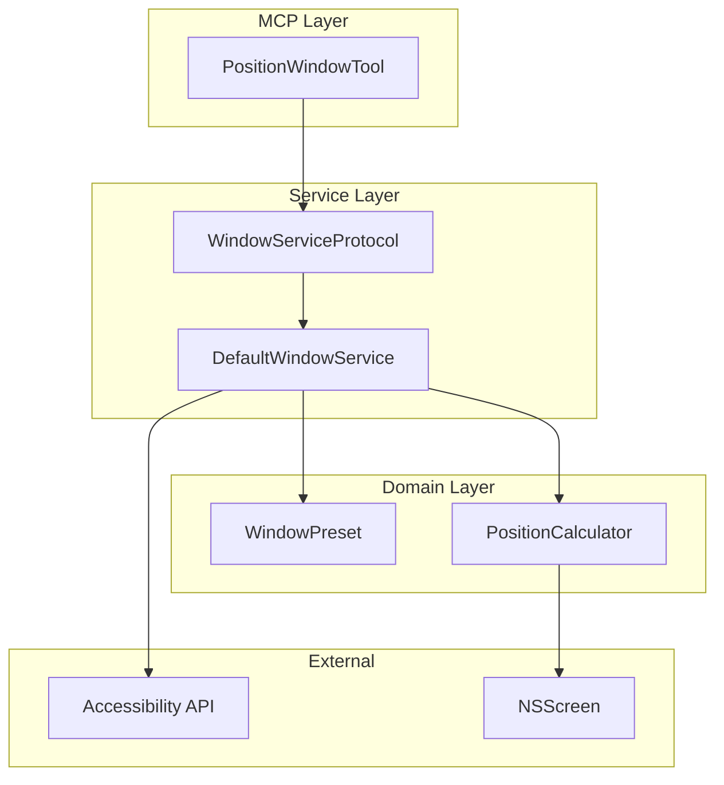
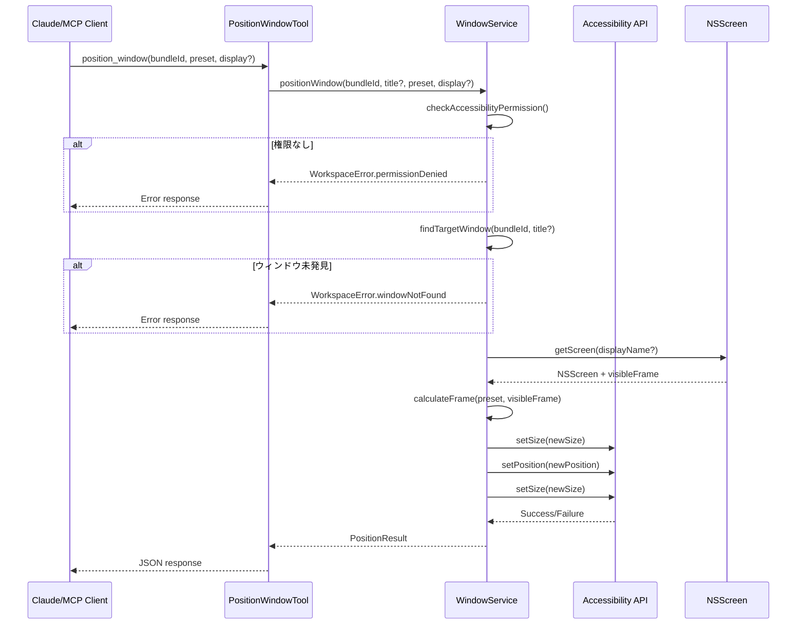
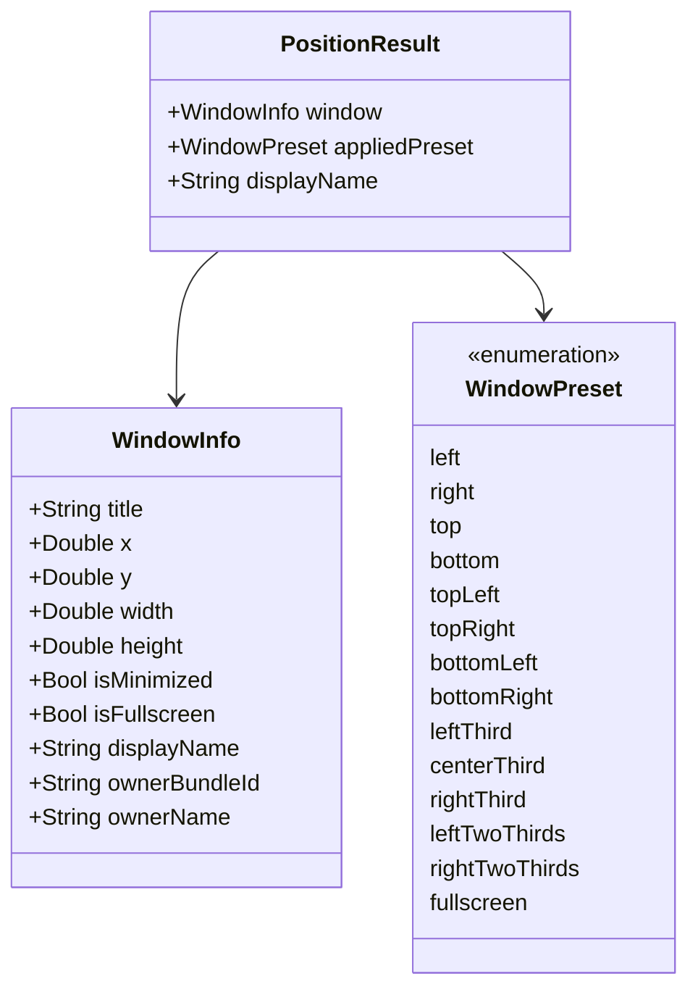

# Technical Design: Window Positioning

## Overview

**Purpose**: 本機能はマルチタスクユーザーに対して、ウィンドウをプリセット位置（左半分、右半分、4分割など）に配置する能力を提供する。

**Users**: Claudeを通じてmacOSのウィンドウレイアウトを効率的に管理したいユーザーが対象。

**Impact**: 既存のWindowServiceProtocolを拡張し、新規MCPツール`position_window`を追加する。

### Goals
- 13種類のプリセット配置（2分割、3分割、4分割、フルスクリーン）をサポート
- メニューバー・Dockを考慮した作業領域内への配置
- マルチディスプレイ環境での配置先ディスプレイ指定

### Non-Goals
- カスタム比率・座標による配置（将来拡張）
- ウィンドウのアニメーション制御
- 複数ウィンドウの一括配置

## Architecture

### Existing Architecture Analysis

現在のシステムは以下のパターンを採用：
- **Protocol-based Service**: `WindowServiceProtocol`でウィンドウ操作を抽象化
- **MCP Tool Pattern**: `MCPTool`プロトコル準拠のツールクラス
- **ToolRegistry**: ツールのルーティングと依存注入

既存の`DefaultWindowService`はCGWindowList APIとAccessibility APIを併用してウィンドウ情報を取得している。ウィンドウの位置・サイズ変更にはAccessibility APIの`AXUIElementSetAttributeValue`を使用する。

### Architecture Pattern & Boundary Map



**Architecture Integration**:
- Selected pattern: 既存Service拡張パターン
- Domain/feature boundaries: WindowService内に配置ロジックをカプセル化
- Existing patterns preserved: MCPTool、Protocol-based Service
- New components rationale: PositionWindowTool（MCPエントリポイント）、WindowPreset（プリセット定義）、PositionCalculator（座標計算）
- Steering compliance: 既存アーキテクチャに準拠

### Technology Stack

| Layer | Choice / Version | Role in Feature | Notes |
|-------|------------------|-----------------|-------|
| MCP Tool | Swift + MCP library | ツールインターフェース | 既存パターン踏襲 |
| Service | Swift + AppKit | ウィンドウ操作 | DefaultWindowService拡張 |
| System API | Accessibility API (AX) | ウィンドウ位置・サイズ設定 | AXUIElementSetAttributeValue |
| Screen API | NSScreen | ディスプレイ情報・作業領域取得 | visibleFrame使用 |

## System Flows

### ウィンドウ配置フロー



**Key Decisions**:
- サイズ→位置→サイズの順序でディスプレイ間移動に対応
- 最小化ウィンドウは操作前にチェックして拒否

## Requirements Traceability

| Requirement | Summary | Components | Interfaces | Flows |
|-------------|---------|------------|------------|-------|
| 1.1 | プリセット配置実行 | PositionWindowTool, WindowService | positionWindow() | 配置フロー |
| 1.2 | 2分割プリセット | WindowPreset | left, right, top, bottom | - |
| 1.3 | 4分割プリセット | WindowPreset | topLeft, topRight, bottomLeft, bottomRight | - |
| 1.4 | 3分割プリセット | WindowPreset | leftThird, centerThird, rightThird, leftTwoThirds, rightTwoThirds | - |
| 1.5 | フルスクリーン | WindowPreset | fullscreen | - |
| 2.1, 2.2, 2.3 | 作業領域考慮 | PositionCalculator | calculateFrame() | - |
| 3.1 | ディスプレイ指定 | WindowService | displayName parameter | - |
| 3.2 | デフォルトディスプレイ | WindowService | 現在ディスプレイ検出 | - |
| 3.3 | ディスプレイ未発見エラー | WorkspaceError | displayNotFound | - |
| 4.1, 4.2 | ウィンドウ識別 | WindowService | bundleId, title parameters | - |
| 4.3, 4.4 | ウィンドウ未発見/複数一致 | WindowService | findTargetWindow() | - |
| 5.1 | 権限エラー | WorkspaceError | permissionDenied | - |
| 5.2 | 最小化エラー | WorkspaceError | windowMinimized | - |
| 5.3 | 操作失敗エラー | WorkspaceError | positioningFailed | - |
| 5.4 | 成功レスポンス | PositionResult | WindowInfo返却 | - |

## Components and Interfaces

| Component | Domain/Layer | Intent | Req Coverage | Key Dependencies | Contracts |
|-----------|--------------|--------|--------------|------------------|-----------|
| PositionWindowTool | MCP | MCPツールエントリポイント | 1.1 | WindowService (P0) | Service |
| WindowPreset | Domain | プリセット定義 | 1.2-1.5 | None | - |
| PositionCalculator | Domain | 座標計算 | 2.1-2.3 | NSScreen (P0) | Service |
| WindowService (拡張) | Service | ウィンドウ操作 | 3.1-4.4 | AX API (P0), NSScreen (P1) | Service |
| WorkspaceError (拡張) | Common | エラー定義 | 5.1-5.3 | None | - |
| PositionResult | Model | 結果モデル | 5.4 | WindowInfo (P1) | - |

### MCP Layer

#### PositionWindowTool

| Field | Detail |
|-------|--------|
| Intent | MCPプロトコル経由でウィンドウ配置コマンドを受け付ける |
| Requirements | 1.1 |

**Responsibilities & Constraints**
- MCPリクエストのパース・バリデーション
- WindowServiceへの委譲
- レスポンスのJSON整形

**Dependencies**
- Outbound: WindowServiceProtocol — ウィンドウ操作 (P0)

**Contracts**: Service [x]

##### Service Interface
```swift
public struct PositionWindowTool: MCPTool {
    static let name = "position_window"
    static let definition: Tool

    func execute(arguments: [String: Any]) async -> CallTool.Result
}
```

**Implementation Notes**
- 必須パラメーター: bundleId, preset
- オプションパラメーター: title, displayName

### Domain Layer

#### WindowPreset

| Field | Detail |
|-------|--------|
| Intent | 13種類のプリセット配置を型安全に定義 |
| Requirements | 1.2, 1.3, 1.4, 1.5 |

**Contracts**: State [x]

##### State Management
```swift
public enum WindowPreset: String, Codable, CaseIterable, Sendable {
    // 2分割
    case left           // 左半分 (50%)
    case right          // 右半分 (50%)
    case top            // 上半分 (50%)
    case bottom         // 下半分 (50%)

    // 4分割
    case topLeft        // 左上 (25%)
    case topRight       // 右上 (25%)
    case bottomLeft     // 左下 (25%)
    case bottomRight    // 右下 (25%)

    // 3分割
    case leftThird      // 左1/3 (33.3%)
    case centerThird    // 中央1/3 (33.3%)
    case rightThird     // 右1/3 (33.3%)
    case leftTwoThirds  // 左2/3 (66.7%)
    case rightTwoThirds // 右2/3 (66.7%)

    // フルスクリーン
    case fullscreen     // 全画面 (100%)
}
```

#### PositionCalculator

| Field | Detail |
|-------|--------|
| Intent | プリセットとvisibleFrameから配置先CGRectを計算 |
| Requirements | 2.1, 2.2, 2.3 |

**Dependencies**
- External: NSScreen — visibleFrame取得 (P0)

**Contracts**: Service [x]

##### Service Interface
```swift
public enum PositionCalculator {
    /// プリセットに基づいてウィンドウフレームを計算
    /// - Parameters:
    ///   - preset: 配置プリセット
    ///   - visibleFrame: ディスプレイの作業領域
    /// - Returns: 計算されたウィンドウフレーム
    static func calculateFrame(
        preset: WindowPreset,
        visibleFrame: CGRect
    ) -> CGRect
}
```

- Preconditions: visibleFrameは有効な矩形
- Postconditions: 返却されるCGRectはvisibleFrame内に収まる
- Invariants: なし

### Service Layer

#### WindowServiceProtocol (拡張)

| Field | Detail |
|-------|--------|
| Intent | ウィンドウ配置メソッドをプロトコルに追加 |
| Requirements | 3.1, 3.2, 4.1, 4.2, 4.3, 4.4 |

**Contracts**: Service [x]

##### Service Interface
```swift
public protocol WindowServiceProtocol: Sendable {
    // 既存メソッド
    func listWindows(bundleId: String?) async throws -> [WindowInfo]
    func checkAccessibilityPermission() -> Bool

    // 新規追加
    /// ウィンドウを指定位置に配置する
    /// - Parameters:
    ///   - bundleId: 対象アプリケーションのbundle ID
    ///   - title: ウィンドウタイトル（オプション、フィルタリング用）
    ///   - preset: 配置プリセット
    ///   - displayName: 配置先ディスプレイ名（オプション）
    /// - Returns: 配置後のウィンドウ情報
    /// - Throws: WorkspaceError
    func positionWindow(
        bundleId: String,
        title: String?,
        preset: WindowPreset,
        displayName: String?
    ) async throws -> PositionResult
}
```

- Preconditions: Accessibility権限が付与されている
- Postconditions: 対象ウィンドウが指定位置に配置される
- Invariants: 最小化ウィンドウは操作不可

**Implementation Notes**
- Integration: 既存のlistWindows実装パターンを踏襲
- Validation: bundleIdは必須、presetは有効な値
- Risks: 一部アプリはAX操作を拒否する可能性

### Common Layer

#### WorkspaceError (拡張)

| Field | Detail |
|-------|--------|
| Intent | ウィンドウ配置固有のエラーケースを追加 |
| Requirements | 5.1, 5.2, 5.3 |

##### State Management
```swift
public enum WorkspaceError: Error, Sendable {
    // 既存ケース
    case applicationNotFound(bundleId: String)
    case applicationNotRunning(bundleId: String)
    case launchFailed(bundleId: String, reason: String)
    case permissionDenied
    case invalidParameter(name: String, reason: String)

    // 新規追加
    /// 指定されたウィンドウが見つからない
    case windowNotFound(bundleId: String, title: String?)

    /// ウィンドウが最小化されている
    case windowMinimized(bundleId: String, title: String?)

    /// ウィンドウ配置に失敗
    case positioningFailed(reason: String)

    /// 指定されたディスプレイが見つからない
    case displayNotFound(displayName: String)
}
```

### Model Layer

#### PositionResult

| Field | Detail |
|-------|--------|
| Intent | 配置操作の結果を表現 |
| Requirements | 5.4 |

##### State Management
```swift
public struct PositionResult: Codable, Sendable {
    /// 配置後のウィンドウ情報
    public let window: WindowInfo

    /// 適用されたプリセット
    public let appliedPreset: WindowPreset

    /// 配置先ディスプレイ名
    public let displayName: String
}
```

## Data Models

### Domain Model



### Data Contracts & Integration

**MCP Tool Input Schema**:
```json
{
  "type": "object",
  "properties": {
    "bundleId": {
      "type": "string",
      "description": "対象アプリケーションのbundle ID（必須）"
    },
    "title": {
      "type": "string",
      "description": "ウィンドウタイトル（オプション）"
    },
    "preset": {
      "type": "string",
      "enum": ["left", "right", "top", "bottom", "topLeft", "topRight", "bottomLeft", "bottomRight", "leftThird", "centerThird", "rightThird", "leftTwoThirds", "rightTwoThirds", "fullscreen"],
      "description": "配置プリセット（必須）"
    },
    "displayName": {
      "type": "string",
      "description": "配置先ディスプレイ名（オプション）"
    }
  },
  "required": ["bundleId", "preset"]
}
```

**MCP Tool Output Schema**:
```json
{
  "type": "object",
  "properties": {
    "window": { "$ref": "#/definitions/WindowInfo" },
    "appliedPreset": { "type": "string" },
    "displayName": { "type": "string" }
  }
}
```

## Error Handling

### Error Categories and Responses

**User Errors (4xx equivalent)**:
- `invalidParameter`: preset値が不正 → 有効なプリセット一覧を提示
- `windowNotFound`: 対象ウィンドウ未発見 → bundleId/titleの確認を促す
- `displayNotFound`: 指定ディスプレイ未発見 → 利用可能なディスプレイ一覧を提示

**System Errors (5xx equivalent)**:
- `permissionDenied`: Accessibility権限なし → システム環境設定への誘導
- `positioningFailed`: AX操作失敗 → リトライまたはアプリの状態確認を促す

**Business Logic Errors**:
- `windowMinimized`: 最小化ウィンドウへの操作 → ウィンドウの復元を促す

## Testing Strategy

### Unit Tests
- `WindowPreset`: 全14ケースの定義確認、rawValue変換
- `PositionCalculator`: 各プリセットの座標計算、境界ケース
- `WorkspaceError`: 新規エラーケースのuserMessage生成

### Integration Tests
- `PositionWindowTool`: パラメーターバリデーション、正常系レスポンス
- `WindowService.positionWindow`: モックAX APIとの連携

### E2E Tests
- 実際のウィンドウ配置操作（手動テスト推奨）
- マルチディスプレイ環境での配置確認
